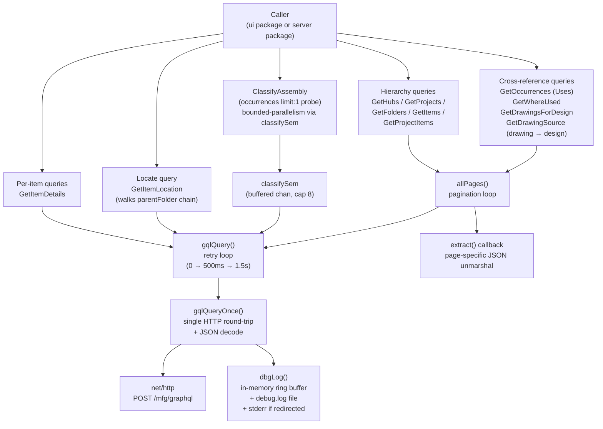
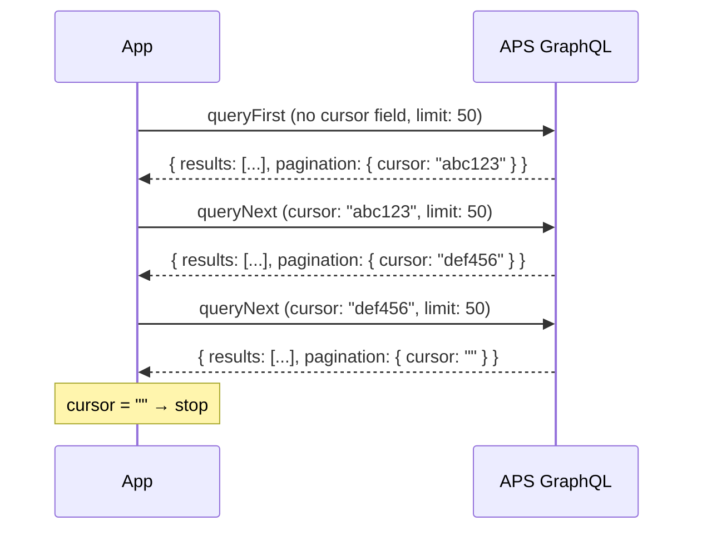
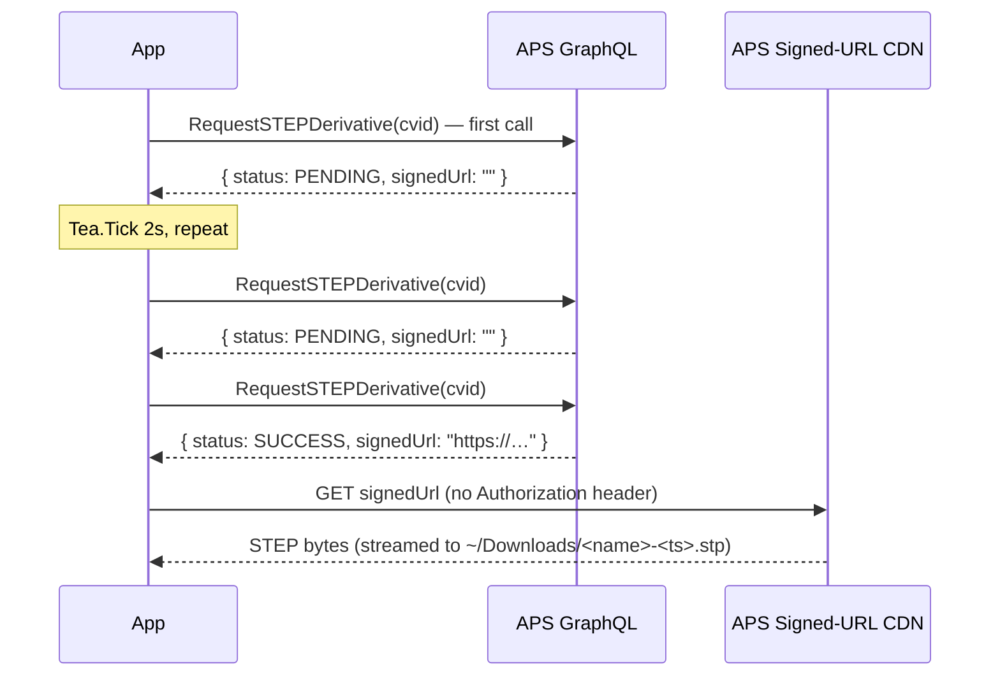

# APS Manufacturing Data Model API

fusionlocalserver queries the **APS Manufacturing Data Model GraphQL API v2** to retrieve hub, project, folder, and item data. All requests are authenticated with a Bearer token obtained through the OAuth PKCE flow. This `api` package is the shared core used by both the TUI and the `-server` HTTP mode; the diagrams below describe the GraphQL client itself, independent of which front end calls it.

---

## GraphQL Endpoint

```
POST https://developer.api.autodesk.com/mfg/graphql
Content-Type: application/json
Authorization: Bearer <access_token>
X-Ads-Region: <region>          (optional — US default, EMEA, or AUS)
```

The `X-Ads-Region` header is only sent when a non-default region is configured. It is omitted entirely for US hubs.

---

## API Client Design



---

## Pagination Strategy

The APS GraphQL API uses **cursor-based pagination**. A page returns a cursor string; passing that cursor in the next request fetches the following page. An empty cursor means the last page has been reached.

**Critical implementation detail:** The API rejects a first-page request that includes a `cursor` variable set to `null` or `""`. Two separate query strings are used per endpoint — one without a cursor parameter, one with `$cursor: String!`.



Pagination limit is set to `50` per page. The APS validator rejects values ≥ 100 outright (`"pagination must be between 0 and 100"`), and even at 99 the GraphQL query-cost cap (1000 points) is exceeded by the field set this app uses — 200 results blew through it. 50 is the original safe value used since v0.1 and is enforced via the `pageSize = 50` constant in `api/queries.go`.

---

## Queries

### GetHubs

Fetches all hubs the authenticated user has access to.

```graphql
# First page
query GetHubs {
    hubs(pagination: { limit: 50 }) {
        pagination { cursor }
        results {
            id
            name
            fusionWebUrl
            alternativeIdentifiers {
                dataManagementAPIHubId
            }
        }
    }
}

# Subsequent pages
query GetHubsNext($cursor: String!) {
    hubs(pagination: { cursor: $cursor, limit: 50 }) {
        pagination { cursor }
        results {
            id
            name
            fusionWebUrl
            alternativeIdentifiers {
                dataManagementAPIHubId
            }
        }
    }
}
```

**Output fields used:**

| Field | Maps to |
|-------|---------|
| `id` | `NavItem.ID` |
| `name` | `NavItem.Name` |
| `fusionWebUrl` | `NavItem.WebURL` |
| `alternativeIdentifiers.dataManagementAPIHubId` | `NavItem.AltID` (used to build browser URLs) |

---

### GetProjects

Fetches projects within a hub. Uses the `hub(hubId)` nested resolver. Inactive projects are filtered client-side.

```graphql
# First page
query GetProjects($hubId: ID!) {
    hub(hubId: $hubId) {
        projects(pagination: { limit: 50 }) {
            pagination { cursor }
            results {
                id
                name
                fusionWebUrl
                projectStatus
                projectType
                alternativeIdentifiers {
                    dataManagementAPIProjectId
                }
            }
        }
    }
}

# Subsequent pages
query GetProjectsNext($hubId: ID!, $cursor: String!) {
    hub(hubId: $hubId) {
        projects(pagination: { cursor: $cursor, limit: 50 }) {
            pagination { cursor }
            results { ... }
        }
    }
}
```

**Filtering:** Projects where `projectStatus` is `"inactive"` (case-insensitive) are excluded from results.

---

### GetFolders

Fetches top-level folders for a project.

```graphql
# First page
query GetFolders($projectId: ID!) {
    foldersByProject(projectId: $projectId, pagination: { limit: 50 }) {
        pagination { cursor }
        results {
            id
            name
        }
    }
}
```

Folders have no `fusionWebUrl` — their URL is constructed from project context when needed.

---

### GetProjectItems

Fetches items (designs, drawings) directly under a project root (not inside a folder).

```graphql
# First page
query GetProjectItems($projectId: ID!) {
    itemsByProject(projectId: $projectId, pagination: { limit: 50 }) {
        pagination { cursor }
        results {
            __typename
            id
            name
        }
    }
}
```

---

### GetItems

Fetches items within a specific folder.

```graphql
# First page
query GetItems($hubId: ID!, $folderId: ID!) {
    itemsByFolder(hubId: $hubId, folderId: $folderId, pagination: { limit: 50 }) {
        pagination { cursor }
        results {
            __typename
            id
            name
            ... on DesignItem {
                tipRootComponentVersion { id }
            }
        }
    }
}
```

The `... on DesignItem` inline fragment captures `tipRootComponentVersion.id` per design row in the same query, so the async assembly classifier (see [ClassifyAssembly](#classifyassembly--asyncpartassembly-subtype) below) doesn't have to round-trip back to APS just to discover which component-version id to probe for occurrences. Drawings, configured designs, and folders ignore the fragment and the field simply isn't present in their results. `GetProjectItems` uses the same inline fragment for the project-root items.

---

### ClassifyAssembly — async part/assembly subtype

Lightweight probe used to refine each design row's icon from a generic "design" to either `assembly` or `part` after the items list has rendered. Lives in `api/classify.go`.

```graphql
query ClassifyAssembly($cv: ID!) {
    componentVersion(componentVersionId: $cv) {
        occurrences(pagination: { limit: 1 }) {
            results { id }
        }
    }
}
```

The query is intentionally cheap — `limit: 1` is the minimum allowed and APS only has to look up a single sub-component (or report empty) to answer. Returning `len(results) > 0` is the entire classification decision: any sub-component means assembly, no sub-component means part. There is no `componentCount` or `hasOccurrences` aggregate on `ComponentVersion` in the current schema (verified via introspection at `cmd/probe-assembly/`), so the limit-1 probe is the cheapest available signal.

**Concurrency cap.** A package-level buffered channel acts as a semaphore so a fan-out of N classification cmds from a single `contentsLoadedMsg` translates into at most 8 simultaneous HTTPS round-trips against the gateway:

```go
var classifySem = make(chan struct{}, 8)

func ClassifyAssembly(ctx context.Context, token, componentVersionID string) (bool, error) {
    select {
    case classifySem <- struct{}{}:
    case <-ctx.Done():
        return false, ctx.Err()
    }
    defer func() { <-classifySem }()
    // ... GraphQL call ...
}
```

8 was chosen empirically — see `cmd/probe-assembly/` for the latency-vs-parallelism data on a real hub. Higher caps return diminishing throughput per the gateway's per-tenant rate limits; lower caps leave wall-clock latency on the table.

**Cancellation.** `ClassifyAssembly` itself takes a context but does not implement explicit cancellation of in-flight calls when the user navigates away. Instead, the caller-side dispatch flow in `ui/app.go` carries a `contentsGen` counter on the Model that's incremented every time the Contents slice is replaced (folder drill, hub switch, project switch, refresh, error recovery). Each `classifyDesignCmd` captures the gen at dispatch and stamps it on the resulting `itemClassifiedMsg`; the Update handler drops the message when `msg.gen != m.contentsGen`. Late results aren't cancelled mid-flight — they complete, post their message, and get ignored. This is cheap and lock-free; see [`docs/architecture.md`](architecture.md#async-assembly-vs-part-classification) for the full sequence diagram.

The classifier is fire-and-forget; per-row errors keep the row's generic design icon (graceful degradation) and never surface as user-visible noise.

---

### GetItemDetails

Fetches rich metadata for a single item plus its complete version history. This query is not paginated.

```graphql
query GetItemDetails($hubId: ID!, $itemId: ID!) {
    item(hubId: $hubId, itemId: $itemId) {
        __typename
        id
        name
        size
        mimeType
        extensionType
        createdOn
        createdBy  { firstName lastName }
        lastModifiedOn
        lastModifiedBy { firstName lastName }

        ... on DesignItem {
            fusionWebUrl
            tipVersion { versionNumber }
            tipRootComponentVersion {
                partNumber
                partDescription
                materialName
                isMilestone
            }
        }
        ... on DrawingItem {
            fusionWebUrl
            tipVersion { versionNumber }
        }
        ... on ConfiguredDesignItem {
            fusionWebUrl
            tipVersion { versionNumber }
        }
    }

    itemVersions(hubId: $hubId, itemId: $itemId) {
        results {
            versionNumber
            name
            createdOn
            createdBy { firstName lastName }
        }
    }
}
```

`itemVersions.results` are returned oldest-first by the API. The UI reverses the slice to display newest-first.

---

### RequestSTEPDerivative

Asks APS to translate a design's tip root component version into a STEP file and report the signed download URL when ready. Used by the `[d]` key in the UI. Lives in `api/download.go`.

```graphql
query GetGeometry($componentVersionId: ID!) {
    componentVersion(componentVersionId: $componentVersionId) {
        derivatives(derivativeInput: {outputFormat: STEP, generate: true}) {
            expires
            signedUrl
            status
            outputFormat
        }
    }
}
```

The same query both **kicks off** generation (the first call, when no derivative exists yet) and **reports current status** thereafter. APS keeps the worker running between calls, so the client polls until status reaches `SUCCESS` or `FAILED`:



`RequestSTEPDerivative` returns `(status, signedURL, err)`. Status values are `PENDING`, `SUCCESS`, and `FAILED` (the constants `StepStatusPending`, `StepStatusSuccess`, `StepStatusFailed`). `signedURL` is empty until status reaches `SUCCESS`.

**Restrictions:**

- Only valid on `DesignItem`. Drawings, configured designs, and folders/projects have no `tipRootComponentVersion` and the API returns no derivative. The UI checks `details.Typename == "DesignItem"` and `details.RootComponentVersionID != ""` before issuing the call.
- The signed URL expires (the `expires` field is returned but currently unused — the client downloads immediately after `SUCCESS`).

#### DownloadFile

Streams the signed-URL response to a destination path. Critically, **the user's bearer token is intentionally NOT attached** — APS signed URLs are self-authenticated (the signature is embedded in the URL) and adding a bearer would leak the access token to whatever host the signed URL points at. If a poisoned or MITM'd GraphQL response ever returned a non-Autodesk URL, the blast radius is confined to the (already untrusted) signed URL itself.

```go
func DownloadFile(ctx context.Context, url, destPath string) error
```

The destination directory is created (`0755`) if needed; the file is written via `os.Create`. Non-2xx responses are surfaced with the first 2 KiB of the body for diagnostics.

#### StepDownloadPath

Returns a sensible local path for a STEP file derived from `name`:

- Prefers `~/Downloads/<sanitised-name>-<YYYYMMDD-HHMMSS>.stp`
- Falls back to `os.TempDir()` if `os.UserHomeDir()` fails or returns empty
- Filenames are sanitised to alphanumerics + `- _ . space` (everything else becomes `_`) so the path round-trips cleanly across Linux, macOS, and Windows

The `userHomeDir` and `nowFunc` package vars are swappable by tests for deterministic output (see Testing below).

---

## NavItem Struct

All list queries produce `[]NavItem`. This is the fundamental navigation unit passed between the `api` and `ui` packages.

```go
type NavItem struct {
    ID          string  // GraphQL node ID
    Name        string
    Kind        string  // see table below
    AltID       string  // dataManagementAPIHubId or dataManagementAPIProjectId
    WebURL      string  // fusionWebUrl if available
    IsContainer bool    // true for hub, project, folder

    // ComponentVersionID is the lineage id of tipRootComponentVersion,
    // captured by GetItems / GetProjectItems via the
    // ... on DesignItem inline fragment so the async classifier can
    // probe occurrences directly without a per-row round-trip.
    // Populated only for Kind == "design"; empty for everything else.
    ComponentVersionID string

    // Subtype refines Kind into a displayed type tag in the Contents
    // column. Two fill paths:
    //
    //   - Designs: filled in asynchronously by ClassifyAssembly
    //     ("assembly" | "part" | "" while in flight)
    //   - Drawings: filled in synchronously from the filename
    //     extension at items-list time ("dwg" | "template")
    //
    // For Fusion Electronics types (pcb / schematic / ecad) the Kind
    // itself implies the tag; Subtype is unused. See subtypeSuffix()
    // in ui/app.go for the full label table.
    Subtype string
}
```

**Kind mapping — combined `__typename` + filename extension:**

The primary signal is `__typename`. When that comes back as anything outside the table below, `navItemFromResult` falls back to `kindFromExtension(item.name)` so Fusion Electronics rows (whose APS typenames aren't documented and can't be discovered via `__schema` introspection, which APS production blocks) still get a useful Kind.

| Source | Value | `Kind` | `IsContainer` | Notes |
|---|---|---|---|---|
| (set explicitly) | hub | `"hub"` | `true` | |
| (set explicitly) | project | `"project"` | `true` | |
| `__typename` | `Folder` | `"folder"` | `true` | |
| `__typename` | `DesignItem` | `"design"` | `false` | `ComponentVersionID` from inline `tipRootComponentVersion.id`; `Subtype` filled async by `ClassifyAssembly` |
| `__typename` | `DrawingItem` | `"drawing"` | `false` | `Subtype` filled synchronously: `"template"` for `.f2t`, `"dwg"` otherwise |
| `__typename` | `ConfiguredDesignItem` | `"configured"` | `false` | |
| extension | `.f3d` | `"design"` | `false` | Fallback when typename is unknown |
| extension | `.f2d` / `.f2t` | `"drawing"` | `false` | Fallback |
| extension | `.fsch` | `"schematic"` | `false` | Fusion schematic |
| extension | `.fbrd` | `"pcb"` | `false` | Fusion PCB board |
| extension | `.fprj` | `"ecad"` | `false` | Fusion Electronics project archive |
| (none of the above) | — | `"unknown"` | `false` | Logged at debug; renderer shows the row with the default design icon and no type tag |

---

## ItemDetails Struct

Returned by `GetItemDetails`. Contains everything needed for the details panel.

```go
type ItemDetails struct {
    ID            string
    Name          string
    Typename      string        // DesignItem | DrawingItem | ConfiguredDesignItem | BasicItem
    Size          string        // raw bytes as string from API
    MimeType      string
    ExtensionType string
    FusionWebURL  string
    CreatedOn     time.Time
    CreatedBy     string        // "First Last"
    ModifiedOn    time.Time
    ModifiedBy    string
    VersionNumber int           // tipVersion.versionNumber
    // Design-specific
    PartNumber  string
    PartDesc    string
    Material    string
    IsMilestone bool
    // Versions — most recent first
    Versions []VersionSummary
}

type VersionSummary struct {
    Number    int
    CreatedOn time.Time
    CreatedBy string
    Comment   string           // version save comment (may be empty)
}
```

---

## Cross-reference Queries (Details-pane tabs)

The Uses, Where Used, and Drawings tabs each call a dedicated query in `api/refs.go`. Drawings have their own `GetDrawingSource` for the Uses tab because their relationship to a source design is rooted differently in the schema.

### GetOccurrences — Uses tab on a DesignItem

```graphql
query GetOccurrences($cvId: ID!) {
  componentVersion(componentVersionId: $cvId) {
    occurrences(pagination: { limit: 50 }) {
      pagination { cursor }
      results {
        id
        componentVersion {
          id name partNumber partDescription materialName
          designItemVersion { item { id name fusionWebUrl } }
        }
      }
    }
  }
}
```

Returns `[]ComponentRef` — one row per immediate sub-component instance. Note this is *occurrences* (one row per instance in the assembly), not *unique components* — a design with five identical bolts shows five rows.

### GetWhereUsed — designs that reference this component

```graphql
query GetWhereUsed($cvId: ID!) {
  componentVersion(componentVersionId: $cvId) {
    whereUsed(pagination: { limit: 50 }) {
      pagination { cursor }
      results {
        id name partNumber partDescription materialName
        designItemVersion { item { id name fusionWebUrl } }
      }
    }
  }
}
```

APS returns one `ComponentVersion` per *version* of each parent design that references the queried component. The function dedupes by parent `DesignItem.id` so a parent design with N saved versions appears once. Refs whose `designItemVersion.item.id` is empty (orphan component versions) are passed through unchanged.

### GetDrawingsForDesign — Drawings tab on a DesignItem

```graphql
query GetDrawingsForDesign($hubId: ID!, $itemId: ID!) {
  item(hubId: $hubId, itemId: $itemId) {
    ... on DesignItem {
      versions(pagination: { limit: 10 }) {
        pagination { cursor }
        results {
          drawingItemVersions(pagination: { limit: 5 }) {
            results {
              lastModifiedOn
              lastModifiedBy { firstName lastName }
              item { id name fusionWebUrl }
            }
          }
        }
      }
    }
  }
}
```

The query is rooted at the **DesignItem**, not the tip-root component version, because Fusion drawings reference a *specific version* of the source component — when the design is saved, the tip-root cvid changes but the drawing keeps pointing at the older one. `componentVersion(tipRoot).drawingVersions` returns empty for any design that has been edited since its drawing was created.

The `versions` field is paginated (10 per round trip) because APS caps query complexity at 1000 points and the original 50×50 layout scored 23000+. Within each design version, up to 5 drawing-item-versions are pulled — covers the realistic case (most designs have 1–2 drawings, very few have >5 against the same version).

Results are deduped by drawing lineage URN (`item.id`), keeping the most-recently-modified entry's metadata. The list is returned newest-first.

### GetDrawingSource — Uses tab on a DrawingItem

```graphql
query GetDrawingSource($hubId: ID!, $itemId: ID!) {
  item(hubId: $hubId, itemId: $itemId) {
    ... on DrawingItem {
      tipDrawingVersion {
        componentVersion {
          id name partNumber partDescription materialName
          designItemVersion {
            item { id name fusionWebUrl }
          }
        }
      }
    }
  }
}
```

Returns `[]ComponentRef` of length 0 or 1 (typically 1 — most drawings have a single source design). Uses the tip drawing version; older drawing versions that pointed at different designs are not surfaced (rare edge case).

### GetItemLocation — Show in Location

```graphql
# 1. Item's project + immediate parent folder
query LocateItem($hubId: ID!, $itemId: ID!) {
  item(hubId: $hubId, itemId: $itemId) {
    project {
      id name
      hub { id }
      alternativeIdentifiers { dataManagementAPIProjectId }
    }
    parentFolder { id name }
  }
}

# 2. Walk parentFolder up to the project root, one query per level
query GetFolderParent($hubId: ID!, $folderId: ID!) {
  folderByHubId(hubId: $hubId, folderId: $folderId) {
    parentFolder { id name }
  }
}
```

Returns `*ItemLocation` containing the project (id, name, altID, hub id) and a root→leaf folder path. The walk is iterative (one round trip per ancestor level) and capped at 100 hops as a defence against malformed schema responses with cycles. Typical folder trees are 2–4 levels deep, so the cost is modest.

```go
type ItemLocation struct {
    HubID        string
    ProjectID    string
    ProjectAltID string
    ProjectName  string
    FolderPath   []FolderRef // root → ... → leaf parent; empty if item is in project root
}

type FolderRef struct {
    ID   string
    Name string
}
```

The UI consumes this in `handleItemLocation` to: (1) verify the hub matches the current selection, (2) find the project in `m.cols[colProjects]` and move the cursor, (3) queue a `pendingNavState` with the folder chain, (4) drill folder-by-folder via `loadItemsCmd` until the leaf, (5) place the cursor on the target item. See [`docs/navigation.md`](navigation.md#tab-cursor-and-show-in-location) for the user-visible flow.

---

## Timestamp Parsing

The API returns timestamps in ISO-8601 format. Two formats are handled:

```go
// Primary: RFC 3339
time.Parse(time.RFC3339, s)           // "2026-03-15T14:30:00Z"

// Fallback: millisecond variant
time.Parse("2006-01-02T15:04:05.000Z", s)   // "2026-03-15T14:30:00.000Z"
```

---

## Error Handling and Retry

GraphQL errors are returned in a top-level `errors` array alongside `data`. Each error carries `extensions.code`, `extensions.errorType`, and `extensions.correlation_id`. The client collects all error messages and joins them with `"; "`:

```json
{
  "errors": [
    {
      "message": "Requested resource not found.",
      "extensions": {
        "code": "NOT_FOUND",
        "errorType": "UNKNOWN",
        "service": "cw",
        "correlation_id": "..."
      }
    }
  ]
}
```

**HTTP-level errors:**
- `401 Unauthorized` → short-circuited before body parsing; surfaced as `"unauthorized (HTTP 401) — token may be expired or lacks scope/entitlement; body: <raw>"`. Bypassing the JSON decode avoids spurious "parsing GraphQL response" errors when APS returns a non-JSON 401 body.
- `408 / 429 / 5xx` → retried (see below).
- Other 4xx → response body parsed and surfaced verbatim, no retry.

### Bounded retry on transient APS gateway flakiness

The MFG GraphQL gateway intermittently returns `code:NOT_FOUND, errorType:UNKNOWN` for hub URNs it just successfully enumerated via the `hubs` query. The same query body, same access token, and same hub URN succeeds and fails within seconds. Repro details and a defect-report template are kept outside the repo at `~/Documents/aps-mfg-graphql-flakiness.md` so anyone can pick it up to file with APS.

`gqlQuery` wraps `gqlQueryOnce` in a 3-attempt retry loop with bounded backoffs `0 → 500 ms → 1.5 s` (max ~2 s added latency, well inside the 30 s nav-cmd context). The retry decision:

```mermaid
flowchart TD
    A[gqlQueryOnce returns] --> B{error?}
    B -- no --> OK([return data])
    B -- yes --> C{transport error<br/>or HTTP 408/429/5xx?}
    C -- yes --> RETRY[retry with backoff]
    C -- no --> D{HTTP 401?}
    D -- yes --> FAIL([surface, no retry])
    D -- no --> E{GraphQL errors[]<br/>contain errorType:UNKNOWN?}
    E -- yes --> RETRY
    E -- no --> FAIL
    RETRY --> F{attempts left?}
    F -- yes --> A
    F -- no --> FINAL([surface 'flaky after N attempts'])
```

Concrete `errorType` values (`VALIDATION`, `BAD_USER_INPUT`, etc.) and HTTP 401 are **never** retried — those are real errors. Only the gateway's `UNKNOWN` marker and transport/server-side faults trigger a retry.

If the call is still failing after 3 attempts, the wrapped error reads `APS GraphQL flaky after 3 attempts: <last error>` so the symptom is distinguishable from a one-shot failure when reading logs.

---

## Debug Mode

Set `FUSIONLOCALSERVER_DEBUG=1` before running the **TUI** to enable full request/response logging (the `-server` mode logs structured request lines to stdout instead):

```sh
FUSIONLOCALSERVER_DEBUG=1 fusionlocalserver
```

Logs are written to **three sinks**:

1. **In-memory ring buffer** (max 500 lines) — viewed via the `?` overlay from `stateBrowsing`. The overlay shows the current log file path at the top so the user knows where to grab the text from (the rendered overlay text itself is not selectable).
2. **`~/.config/fusionlocalserver/debug.log`** — opened with `O_TRUNC` on each session start, mode 0600. The path comes from `config.Dir()`. Tail / grep / open in an editor with standard tools while the TUI is running.
3. **Stderr** — *only* when stderr has been redirected (file or pipe). Detected at startup via `os.Stderr.Stat()`'s `ModeCharDevice` bit; when stderr is the terminal, writing to it would smear bubbletea's alternate-screen render, so the mirror is suppressed in that case. When you want stderr capture explicitly, redirect:

   ```sh
   FUSIONLOCALSERVER_DEBUG=1 fusionlocalserver 2> debug.log
   ```

Each log entry includes:
- Query name and variables
- HTTP status code
- Raw JSON response body
- `RETRY attempt=N delay=… lastErr=…` lines whenever the bounded-retry loop kicks in

Authorization headers are never logged. The on-disk log file is mode 0600.

---

## Region Support

APS hubs in EMEA and Australia are served from regional API endpoints. Set the region before running:

```sh
APS_REGION=EMEA fusionlocalserver   # Europe, Middle East, Africa
APS_REGION=AUS  fusionlocalserver   # Australia
```

Or set `"region": "EMEA"` in `~/.config/fusionlocalserver/config.json`.

When a region is set, the `X-Ads-Region` header is added to every GraphQL request.

---

## Testing

The `api` package endpoint is held in a package-level `var` rather than a `const` so tests in any package can swap it for an `httptest.Server` URL:

```go
// api/client.go
var graphqlEndpoint = "https://developer.api.autodesk.com/mfg/graphql"
```

Same-package tests (`api/*_test.go`) can write `graphqlEndpoint` directly. Cross-package tests (notably `ui/` flow tests that drive a `tea.Cmd` which internally calls into `api`) use the exported helper:

```go
// SetGraphqlEndpointForTesting overrides graphqlEndpoint and returns a
// restore func. Production code MUST NOT call this.
func SetGraphqlEndpointForTesting(url string) (restore func())
```

Typical use:

```go
srv := testutil.GraphQLServer(t, func(req testutil.GraphQLRequest) testutil.GraphQLResponse {
    return testutil.GraphQLResponse{ Data: map[string]any{ /* ... */ } }
})
restore := api.SetGraphqlEndpointForTesting(srv.URL)
defer restore()
// drive UI / api code under test...
```

`testutil.GraphQLServer` is in the shared `internal/testutil/` package — see [`docs/architecture.md`](architecture.md) and [`docs/development.md`](development.md) for the full test strategy.

The `download.go` package vars `userHomeDir` and `nowFunc` follow the same pattern: tests overwrite them to redirect downloads into a `t.TempDir()` and produce deterministic timestamps.
