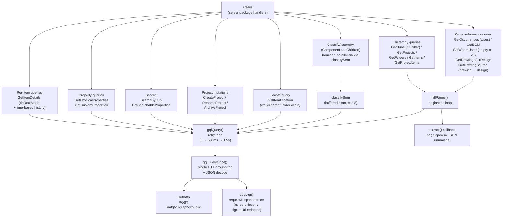
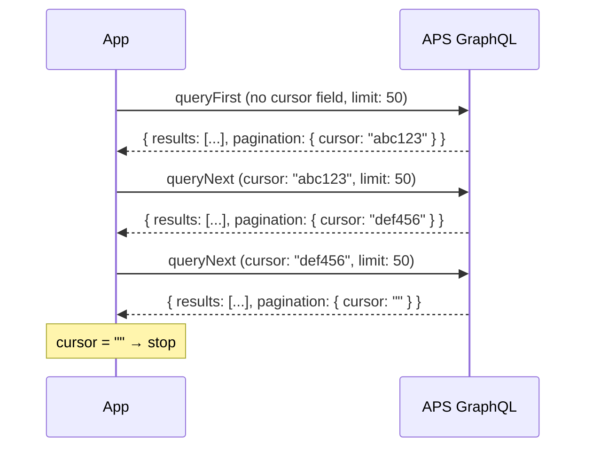

# APS Manufacturing Data Model API

fusionlocalserver queries the **APS Manufacturing Data Model GraphQL API v3** ("Collaborative Editing") to retrieve hub, project, folder, and item data. All requests are authenticated with a Bearer token obtained through the OAuth PKCE flow. This `api` package is the GraphQL client used by the server; the diagrams below describe the client itself, independent of the handlers that call it.

The app is **v3-only** and supports **Collaborative-Editing (CE) hubs only** — Autodesk documents v3 as CE-exclusive. `GetHubs` filters out any hub whose `hubDataVersion` major version is below 2 (a non-CE hub's data does not resolve through the v3 graph). The v2 endpoint (`.../mfg/graphql`) is no longer used.

The biggest v3 shape change: the `ComponentVersion` / `DrawingVersion` types are gone. The graph a design now resolves through is `DesignItem.tipRootModel → Model → component(composition: WORKING) → Component`, and a component/model's `name`, `partNumber`, `materialName`, and `description` (renamed from v2's `partDescription`) are **`Property` objects** (`{ value, displayValue }`), not plain strings. There are also no integer version numbers in v3 — change history is a time-based change log.

---

## GraphQL Endpoint

```
POST https://developer.api.autodesk.com/mfg/v3/graphql/public
Content-Type: application/json
Authorization: Bearer <access_token>
X-Ads-Region: <region>          (optional — US default, EMEA, or AUS)
```

The `X-Ads-Region` header is only sent when a non-default region is configured. It is omitted entirely for US hubs.

---

## The v3 `Property` object

A major v3 change: a component/model's `name`, `partNumber`, `materialName`, and `description` are no longer plain strings — they are **`Property` objects** carrying a typed `value` plus a localized `displayValue`. Wherever a `Property` is returned, the queries select `{ value displayValue }` and decode into this struct:

```go
type Property struct {
    Name         string          `json:"name"`
    DisplayValue string          `json:"displayValue"`
    Value        json.RawMessage `json:"value"`        // opaque PropertyValue scalar
    Definition   struct{ ID string } `json:"definition"`
}

// Str() returns the best human-readable string: displayValue when present,
// otherwise the raw scalar value rendered as a string, "" when absent/null.
func (p Property) Str() string
```

All the design/component metadata fields (`PartNumber`, `PartDesc`, `Material`, BOM/Uses names, …) are produced by calling `Property.Str()`. Note `description` is the v3 rename of v2's `partDescription`.

---

## API Client Design



---

## Pagination Strategy

The APS GraphQL API uses **cursor-based pagination**. A page returns a cursor string; passing that cursor in the next request fetches the following page. An empty cursor means the last page has been reached.

**Critical implementation detail:** The API rejects a first-page request that includes a `cursor` variable set to `null` or `""`. Two separate query strings are used per endpoint — one without a cursor parameter, one with `$cursor: String!`.



Pagination limit is set to `50` per page. The APS validator rejects values ≥ 100 outright (`"pagination must be between 0 and 100"`), and even at 99 the GraphQL query-cost cap (1000 points) is exceeded by the field set this app uses — 200 results blew through it. 50 is the original safe value used since v0.1 and is enforced via the `pageSize = 50` constant in `api/queries.go`.

---

## Queries

### GetHubs

Fetches all hubs the authenticated user has access to, then **filters to CE hubs only**.

```graphql
# First page
query GetHubs {
    hubs(pagination: { limit: 50 }) {
        pagination { cursor }
        results {
            id
            name
            fusionWebUrl
            hubDataVersion
            alternativeIdentifiers {
                dataManagementAPIHubId
            }
        }
    }
}

# Subsequent pages
query GetHubsNext($cursor: String!) {
    hubs(pagination: { cursor: $cursor, limit: 50 }) {
        pagination { cursor }
        results {
            id
            name
            fusionWebUrl
            hubDataVersion
            alternativeIdentifiers {
                dataManagementAPIHubId
            }
        }
    }
}
```

**CE-only filter.** After collecting every page, `GetHubs` drops any hub whose
`hubDataVersion` isn't a Collaborative-Editing version. The `isCEHub` helper parses
the major version and keeps hubs with major ≥ 2 (`"2.0.0"` marks a CE hub); a
missing/empty version is treated as non-CE. v3 is documented CE-exclusive, so a
non-CE hub's data would not resolve through the v3 graph — surfacing it would only
produce errors.

**Output fields used:**

| Field | Maps to |
|-------|---------|
| `id` | `NavItem.ID` |
| `name` | `NavItem.Name` |
| `fusionWebUrl` | `NavItem.WebURL` |
| `hubDataVersion` | CE-only filter (`isCEHub`); not stored on `NavItem` |
| `alternativeIdentifiers.dataManagementAPIHubId` | `NavItem.AltID` (used to build browser URLs) |

---

### GetProjects

Fetches projects within a hub. Uses the `hub(hubId)` nested resolver. Inactive projects are filtered client-side.

```graphql
# First page
query GetProjects($hubId: ID!) {
    hub(hubId: $hubId) {
        projects(pagination: { limit: 50 }) {
            pagination { cursor }
            results {
                id
                name
                fusionWebUrl
                projectStatus
                projectType
                alternativeIdentifiers {
                    dataManagementAPIProjectId
                }
            }
        }
    }
}

# Subsequent pages
query GetProjectsNext($hubId: ID!, $cursor: String!) {
    hub(hubId: $hubId) {
        projects(pagination: { cursor: $cursor, limit: 50 }) {
            pagination { cursor }
            results { ... }
        }
    }
}
```

**Filtering:** Projects where `projectStatus` is `"inactive"` (case-insensitive) are excluded from results.

---

### GetFolders

Fetches top-level folders for a project.

```graphql
# First page
query GetFolders($projectId: ID!) {
    foldersByProject(projectId: $projectId, pagination: { limit: 50 }) {
        pagination { cursor }
        results {
            id
            name
        }
    }
}
```

Folders have no `fusionWebUrl` — their URL is constructed from project context when needed.

---

### GetProjectItems

Fetches items (designs, drawings) directly under a project root (not inside a folder).

```graphql
# First page
query GetProjectItems($projectId: ID!) {
    itemsByProject(projectId: $projectId, pagination: { limit: 50 }) {
        pagination { cursor }
        results {
            __typename
            id
            name
            ... on DesignItem {
                tipRootModel { component { id } }
            }
        }
    }
}
```

---

### GetItems

Fetches items within a specific folder.

```graphql
# First page
query GetItems($hubId: ID!, $folderId: ID!) {
    itemsByFolder(hubId: $hubId, folderId: $folderId, pagination: { limit: 50 }) {
        pagination { cursor }
        results {
            __typename
            id
            name
            ... on DesignItem {
                tipRootModel { component { id } }
            }
        }
    }
}
```

The `... on DesignItem` inline fragment captures the v3 root **Component id** — `tipRootModel.component.id` (the graph is `DesignItem.tipRootModel → Model → Component`) — per design row in the same query, so the async assembly classifier (see [ClassifyAssembly](#classifyassembly--asyncpartassembly-subtype) below) doesn't have to round-trip back to APS just to discover which component id to probe. Drawings, configured designs, and folders ignore the fragment and the field simply isn't present in their results. `GetProjectItems` uses the same inline fragment for the project-root items. The captured id is stored in `NavItem.ComponentVersionID` (the field name predates v3; under v3 it holds a `Component` id).

---

### ClassifyAssembly — async part/assembly subtype

Lightweight probe used to refine each design row's icon from a generic "design" to either `assembly` or `part` after the items list has rendered. Lives in `api/classify.go`. `$cv` is the v3 root **Component id** captured at items-list time (`tipRootModel.component.id`).

```graphql
query ClassifyAssembly($cv: ID!) {
    component(componentId: $cv) {
        hasChildren
    }
}
```

In v3 the classification is a single boolean: `Component.hasChildren` is the entire decision — `true` means assembly (it has at least one direct sub-component), `false` means part. This replaces v2's `componentVersion(...).occurrences(limit: 1)` probe (the `ComponentVersion` type no longer exists). The server fires this as part of a combined `ClassifyAndThumbnail` query per design row (`{ hasChildren thumbnail { status signedUrl } }` in `api/thumbnail.go`), which halves the per-row round-trips and warms the thumbnail cache off the same call.

**Concurrency cap.** A package-level buffered channel acts as a semaphore so a fan-out of N classification calls from a single contents-load translates into at most 8 simultaneous HTTPS round-trips against the gateway:

```go
var classifySem = make(chan struct{}, 8)

func ClassifyAssembly(ctx context.Context, token, componentID string) (bool, error) {
    select {
    case classifySem <- struct{}{}:
    case <-ctx.Done():
        return false, ctx.Err()
    }
    defer func() { <-classifySem }()
    // ... GraphQL call ...
}
```

8 was chosen empirically — see `cmd/probe-assembly/` for the latency-vs-parallelism data on a real hub. Higher caps return diminishing throughput per the gateway's per-tenant rate limits; lower caps leave wall-clock latency on the table.

**Cancellation.** `ClassifyAssembly` takes a context bounded by the handler's request timeout. The web UI issues one `GET /api/items/classify` per design row via TanStack Query; navigating away changes the active query keys, so stale results are simply ignored by the client rather than cancelled mid-flight. Late server-side calls complete and are discarded.

The classifier is fire-and-forget; per-row errors keep the row's generic design icon (graceful degradation) and never surface as user-visible noise.

---

### GetItemDetails

Fetches rich metadata for a single item plus its history. This query is not paginated.

```graphql
query GetItemDetails($hubId: ID!, $itemId: ID!) {
    item(hubId: $hubId, itemId: $itemId) {
        __typename
        id
        name
        size
        mimeType
        extensionType
        createdOn
        createdBy  { firstName lastName }
        lastModifiedOn
        lastModifiedBy { firstName lastName }

        ... on DesignItem {
            fusionWebUrl
            tipRootModel {
                timestamp
                component {
                    id
                    partNumber   { value displayValue }
                    description  { value displayValue }
                    materialName { value displayValue }
                }
            }
            history(pagination: { limit: 50 }) {
                results { __typename id description timestamp author { firstName lastName } }
            }
        }
        ... on ConfiguredDesignItem {
            fusionWebUrl
            history(pagination: { limit: 50 }) {
                results { __typename id description timestamp author { firstName lastName } }
            }
        }
        ... on DrawingItem {
            fusionWebUrl
            history(pagination: { limit: 50 }) {
                results { __typename id description timestamp author { firstName lastName } }
            }
        }
    }
}
```

**No version numbers in v3.** The v2 `tipVersion.versionNumber` / `itemVersions` (integer-numbered versions) are gone. Instead a design carries `history`, a **time-based change log**: each `HistoryChange` has a `timestamp`, a `__typename` (humanized into a `ChangeType` label like `"Version Created"` via `humanizeChangeType`), a `description`, and an `author`. `GetItemDetails` sorts the entries most-recent-first.

The design's metadata now comes from `tipRootModel` (the v3 graph `DesignItem.tipRootModel → Model → component → Component`): `tipRootModel.timestamp` is the tip-state time, and `component.{partNumber,description,materialName}` are **`Property` objects** (`{ value displayValue }`), read into Go via `Property.Str()`. Note `partDescription` (v2) is renamed to `description` (v3). The root `Component.id` is captured into `ItemDetails.RootComponentVersionID` — the handle the thumbnail / properties / Uses probes pass to `component(componentId:)`.

---

### GetBOM

Returns the immediate bill of materials from `Component.bomRelations(depth: 1)`. v3 exposes a **real `quantity` field** on each BOM relation — unlike v2, which had to count occurrences. v3 `bomRelations` supports depth 1 only, so this is the **direct-children** BOM (with true quantities), not a fully flattened multi-level tree. Duplicate child components across relations are collapsed, summing their quantities.

```graphql
query GetBOM($cv: ID!) {
    component(componentId: $cv) {
        bomRelations(depth: 1, pagination: { limit: 50 }) {
            pagination { cursor }
            results {
                quantity
                toComponent {
                    id
                    name         { value displayValue }
                    partNumber   { value displayValue }
                    description  { value displayValue }
                    materialName { value displayValue }
                }
            }
        }
    }
}
```

`$cv` is the v3 root `Component` id. Each row carries the child's id, name, part number, description, material, and quantity (Property fields resolved via `Property.Str()`).

### GetProjectGroups / GetGroupMembers

Access in the Manufacturing Data Model is **per-project and group-based** — there is no per-item or per-user access query.

- `GetProjectGroups` → `project(projectId).groups { results { id name role } }` — the groups with access and their role (e.g. `ADMINISTRATOR`, `EDITOR`). Available to ordinary users.
- `GetGroupMembers` → `group(hubId, groupId).members { results { status user { … } } }` — the users in a group. **Requires hub-admin access**; returns an authorization error (surfaced as HTTP 403) otherwise. `group()` requires both `hubId` and `groupId`.

`project.users` / `project.members` / `hub.users` do **not** exist on the endpoint, and `hub.members` is permission-gated — confirmed by probing the live API.

---

## NavItem Struct

All list queries produce `[]NavItem`. This is the fundamental navigation unit the `api` package returns; the server maps it to the JSON `ItemDTO` the web UI consumes.

```go
type NavItem struct {
    ID          string  // GraphQL node ID
    Name        string
    Kind        string  // see table below
    AltID       string  // dataManagementAPIHubId or dataManagementAPIProjectId
    WebURL      string  // fusionWebUrl if available
    IsContainer bool    // true for hub, project, folder

    // ComponentVersionID carries the v3 root Component id
    // (tipRootModel.component.id), captured by GetItems / GetProjectItems
    // via the ... on DesignItem inline fragment so the async classifier can
    // probe Component.hasChildren directly without a per-row round-trip.
    // Populated only for Kind == "design"; empty for everything else.
    // (The field name predates v3; under v3 it holds a Component id, not a
    // ComponentVersion id.)
    ComponentVersionID string

    // Subtype refines Kind into a displayed type tag in the Contents
    // column. Two fill paths:
    //
    //   - Designs: filled in asynchronously by ClassifyAssembly
    //     ("assembly" | "part" | "" while in flight)
    //   - Drawings: filled in synchronously from the filename
    //     extension at items-list time ("dwg" | "template")
    //
    // For Fusion Electronics types (pcb / schematic / ecad) the Kind
    // itself implies the tag; Subtype is unused. The web UI maps Subtype
    // to the displayed type tag in the Contents column.
    Subtype string
}
```

**Kind mapping — combined `__typename` + filename extension:**

The primary signal is `__typename`. When that comes back as anything outside the table below, `navItemFromResult` falls back to `kindFromExtension(item.name)` so Fusion Electronics rows (whose APS typenames aren't documented and can't be discovered via `__schema` introspection, which APS production blocks) still get a useful Kind.

| Source | Value | `Kind` | `IsContainer` | Notes |
|---|---|---|---|---|
| (set explicitly) | hub | `"hub"` | `true` | |
| (set explicitly) | project | `"project"` | `true` | |
| `__typename` | `Folder` | `"folder"` | `true` | |
| `__typename` | `DesignItem` | `"design"` | `false` | `ComponentVersionID` from inline `tipRootModel.component.id` (the v3 root Component id); `Subtype` filled async by `ClassifyAssembly` |
| `__typename` | `DrawingItem` | `"drawing"` | `false` | `Subtype` filled synchronously: `"template"` for `.f2t`, `"dwg"` otherwise |
| `__typename` | `ConfiguredDesignItem` | `"configured"` | `false` | |
| extension | `.f3d` | `"design"` | `false` | Fallback when typename is unknown |
| extension | `.f2d` / `.f2t` | `"drawing"` | `false` | Fallback |
| extension | `.fsch` | `"schematic"` | `false` | Fusion schematic |
| extension | `.fbrd` | `"pcb"` | `false` | Fusion PCB board |
| extension | `.fprj` | `"ecad"` | `false` | Fusion Electronics project archive |
| (none of the above) | — | `"unknown"` | `false` | Logged at debug; renderer shows the row with the default design icon and no type tag |

---

## ItemDetails Struct

Returned by `GetItemDetails`. Contains everything needed for the details panel.

```go
type ItemDetails struct {
    ID            string
    Name          string
    Typename      string        // DesignItem | DrawingItem | ConfiguredDesignItem | BasicItem
    Size          string        // raw bytes as string from API
    MimeType      string
    ExtensionType string
    FusionWebURL  string
    CreatedOn     time.Time
    CreatedBy     string        // "First Last"
    ModifiedOn    time.Time
    ModifiedBy    string
    // Design-specific — read from tipRootModel → component (v3 Property objects)
    PartNumber string
    PartDesc   string           // from component.description (v2: partDescription)
    Material   string
    // RootComponentVersionID is the v3 root Component id (tipRootModel.component.id) —
    // the handle the thumbnail / properties / Uses probes pass to component(componentId:).
    // (Name predates v3; under v3 it holds a Component id, not a ComponentVersion id.)
    RootComponentVersionID string
    // TipTimestamp is the tip-state time (tipRootModel.timestamp).
    TipTimestamp time.Time
    // History is the v3 time-based change log (most recent first). v3 has no
    // integer version numbers, so this replaces the old version list.
    History []HistoryEntry
}

// HistoryEntry is one entry in the v3 time-based history (a HistoryChange).
// Entries are identified by timestamp + id and labelled by change type rather
// than an integer version number.
type HistoryEntry struct {
    ID          string
    Timestamp   time.Time
    ChangeType  string           // humanized __typename, e.g. "Version Created"
    Description string
    Author      string
}
```

There is no `VersionNumber`, `IsMilestone`, or `Versions []VersionSummary` in v3 — those v2 concepts are gone (`humanizeChangeType` turns each `HistoryChange.__typename`, e.g. `"VersionCreatedHistoryChange"`, into a readable `ChangeType`).

---

## Cross-reference Queries (Details-pane tabs)

The Uses, Where Used, and Drawings tabs each call a dedicated query in `api/refs.go`. Drawings have their own `GetDrawingSource` for the Uses tab because their relationship to a source design is rooted differently in the schema. All component-shaped refs share the v3 `Property`-object field set (`name { value displayValue }`, etc.); `$cv` is the v3 root `Component` id.

### GetOccurrences — Uses tab on a DesignItem

```graphql
query GetOccurrences($cv: ID!) {
  component(componentId: $cv) {
    bomRelations(depth: 1, pagination: { limit: 50 }) {
      pagination { cursor }
      results {
        toComponent {
          id
          name         { value displayValue }
          partNumber   { value displayValue }
          description  { value displayValue }
          materialName { value displayValue }
          primaryModel { designItem { id name fusionWebUrl } }
        }
      }
    }
  }
}
```

Returns `[]ComponentRef` — the immediate sub-components (the "Uses" relationship), via `Component.bomRelations`. v3 has no `ComponentVersion.occurrences`; `bomRelations` returns one entry per direct child component (use [GetBOM](#getbom) when the per-child `quantity` matters).

### GetWhereUsed — designs that reference this component

**Returns empty on v3.** v3 has **no first-class reverse-reference query** (the v2 `componentVersion.whereUsed` field no longer exists). `GetWhereUsed` attempts the only schema-plausible path — reading the component's `primaryModel.assemblyRelations` and keeping relations where this model is the `toModel` (so each `fromModel` is a parent) — but `assemblyRelations` is a **downward** traversal, so it yields `results: []` for every component in practice, and the tab shows nothing. The code is left in place (returning empty) rather than removed, pending research into a viable v3 reverse query.

See [`v3-where-used.md`](v3-where-used.md) for the full investigation, the introspection findings, and the options (hide the tab, find a specific reverse query, or do a cached hub-wide scan).

### GetDrawingsForDesign — Drawings tab on a DesignItem

v3 has no `design → drawings` field, so this **scans the design's project** for `DrawingItem`s whose `tipDrawing.model.designItem` matches the target design. It first resolves the design's project (`item(...).project { id }`), then pages `itemsByProject`:

```graphql
query ProjectDrawings($projectId: ID!) {
  itemsByProject(projectId: $projectId, pagination: { limit: 20 }) {
    pagination { cursor }
    results {
      __typename
      id name lastModifiedOn lastModifiedBy { firstName lastName }
      ... on DrawingItem {
        fusionWebUrl
        tipDrawing { model { designItem { id } } }
      }
    }
  }
}
```

This is a project-wide walk (one paginated query), so it can be costly for large projects. The page size is capped low (**20**) because each row's `tipDrawing.model.designItem` chain is expensive and the v3 gateway enforces a 1000-point query-complexity cap (limit 50 scored 1061). Rows kept are `DrawingItem`s whose `tipDrawing.model.designItem.id` equals the target; results are returned sorted by latest modification (most recent first).

### GetDrawingSource — Uses tab on a DrawingItem

```graphql
query GetDrawingSource($hubId: ID!, $itemId: ID!) {
  item(hubId: $hubId, itemId: $itemId) {
    ... on DrawingItem {
      tipDrawing {
        model {
          component {
            id
            name         { value displayValue }
            partNumber   { value displayValue }
            description  { value displayValue }
            materialName { value displayValue }
          }
          designItem { id name fusionWebUrl }
        }
      }
    }
  }
}
```

For a drawing, "Uses" means the design it was made from — the tip drawing's model and its owning `DesignItem` (`DrawingItem.tipDrawing.model.{component, designItem}`). Returns `[]ComponentRef` of length 0 or 1 (typically 1 — most drawings have a single source design); empty when neither the component nor the design item resolves.

### GetItemLocation — Show in Location

```graphql
# 1. Item's project + immediate parent folder
query LocateItem($hubId: ID!, $itemId: ID!) {
  item(hubId: $hubId, itemId: $itemId) {
    project {
      id name
      hub { id }
      alternativeIdentifiers { dataManagementAPIProjectId }
    }
    parentFolder { id name }
  }
}

# 2. Walk parentFolder up to the project root, one query per level
query GetFolderParent($hubId: ID!, $folderId: ID!) {
  folderByHubId(hubId: $hubId, folderId: $folderId) {
    parentFolder { id name }
  }
}
```

Returns `*ItemLocation` containing the project (id, name, altID, hub id) and a root→leaf folder path. The walk is iterative (one round trip per ancestor level) and capped at 100 hops as a defence against malformed schema responses with cycles. Typical folder trees are 2–4 levels deep, so the cost is modest.

```go
type ItemLocation struct {
    HubID        string
    ProjectID    string
    ProjectAltID string
    ProjectName  string
    FolderPath   []FolderRef // root → ... → leaf parent; empty if item is in project root
}

type FolderRef struct {
    ID   string
    Name string
}
```

The server returns this from `GET /api/items/location` (handler `handleItemLocation`). The web UI uses it to navigate straight to a referenced item — selecting the project, walking the folder chain, and landing on the target — which is how a click in the Uses / Where Used / Drawings tabs jumps the browser to that document. See [`docs/web-ui.md`](web-ui.md) for the user-visible flow.

---

## Properties Queries

The Details "Properties" tab is built from two queries, both keyed by the v3 root `Component` id (`$cv`).

### GetPhysicalProperties — physical/mass properties

Read from `Component.primaryModel.physicalProperties` (in v3, physical properties live on the model, not the component version). Generation is asynchronous (status `SCHEDULED | QUEUED | IN_PROGRESS | COMPLETED | FAILED | CANCELLED`), so callers poll until terminal. Lives in `api/properties.go`.

```graphql
query GetPhysicalProperties($cv: ID!) {
  component(componentId: $cv) {
    primaryModel {
      physicalProperties {
        status
        area    { displayValue definition { units { name } } }
        volume  { displayValue definition { units { name } } }
        mass    { displayValue definition { units { name } } }
        density { displayValue definition { units { name } } }
        boundingBox {
          length { displayValue definition { units { name } } }
          width  { displayValue definition { units { name } } }
          height { displayValue definition { units { name } } }
        }
      }
    }
  }
}
```

Each measure decodes to `{ Display, Units }`. A null `physicalProperties` (e.g. no geometry) is reported as `FAILED` so the UI renders "unavailable" rather than spinning forever.

### GetCustomProperties — extended base + custom properties

Returns a component's "extended" property surface in one query: every (non-hidden, non-archived) **base-property definition on the hub** populated with the component's value where set, plus any user-defined **custom properties** that have a value. The hub supplies the definitions (the fields exist hub-wide even when a component leaves them blank); the component supplies the values. Lives in `api/customprops.go`.

```graphql
query GetItemProperties($hubId: ID!, $cv: ID!) {
  hub(hubId: $hubId) {
    basePropertyDefinitionCollections {
      results {
        definitions {
          results { id name isHidden isArchived }
        }
      }
    }
  }
  component(componentId: $cv) {
    baseProperties   { results { displayValue value definition { id } } }
    customProperties { results { name displayValue value } }
  }
}
```

The component's `baseProperties` values are mapped by definition id, then every visible hub base-property definition is emitted in hub order (populated with the component's value where present — so the user sees the full extended-property surface even when most fields are blank). Populated custom properties are appended. Each row is a `NamedProperty { Name, DisplayValue }`. Best-effort enrichment — callers tolerate an empty list or an error.

---

## Search Queries

Hub-wide search (v3 `searchByHub` / `searchablePropertiesByHub`), in `api/search.go`. The server exposes these at `GET /api/search` and `GET /api/search/properties`; the web UI drives them from a search lightbox. Requires the `data:search` scope.

### GetSearchableProperties — populate the property picker

```graphql
query SearchableProps($hubId: ID!) {
  searchablePropertiesByHub(hubId: $hubId, pagination: { limit: 50 }) {
    results {
      displayName
      propertyDefinition { id }
    }
  }
}
```

Returns `[]SearchableProperty { DisplayName, ID }` — the properties a hub allows filtering on; `ID` is the `propertyDefinition` id passed back as a search field.

### SearchByHub — free-text or property search

Supply **either** `freeText` (full-text) **or** a `propDefID` + `propValue` pair (property search); if both are empty the result is empty. Results are paginated at 25 per page.

```graphql
query SearchByHub($hubId: ID!, $crit: SearchInput, $page: PaginationInput) {
  searchByHub(hubId: $hubId, searchCriteria: $crit, pagination: $page) {
    pagination { cursor }
    results {
      name
      score
      thumbnail { signedUrl }
      matches { matchedText }
      searchResultObject {
        __typename
        ... on Component { id primaryModel { designItem { id hub { id } } } }
        ... on Model { id designItem { id hub { id } } }
        ... on DesignItem { id hub { id } }
        ... on DrawingItem { id hub { id } }
        ... on ConfiguredDesignItem { id hub { id } }
        ... on BasicItem { id hub { id } }
        ... on Folder { id project { hub { id } } }
      }
    }
  }
}
```

The criteria is built as `{ query: freeText }` for free-text, or `{ searchFields: [{ searchableProperty: propDefID, PropertyQuery: [propValue] }] }` for a property search. Each result's polymorphic `searchResultObject` is flattened to a navigable `SearchHit { Name, Score, ThumbnailURL, Matched, ItemID, HubID, Kind }` — a `Component`/`Model` is resolved down to its owning `DesignItem` id so the row can drive Show-in-Location.

---

## Project Mutations

Project lifecycle mutations (v3), in `api/projects.go`. Routed at `POST /api/projects` (create), `POST /api/projects/rename`, and `POST /api/projects/archive`. These require the `data:write` / `data:create` scope.

```graphql
mutation CreateProject($input: CreateProjectInput!) {
  createProject(input: $input) { project { id name fusionWebUrl } }
}

mutation RenameProject($input: RenameProjectInput!) {
  renameProject(input: $input) { project { id name fusionWebUrl } }
}

mutation ArchiveProject($input: ArchiveProjectInput!) {
  archiveProject(input: $input) { project { id } }
}
```

`CreateProject` / `RenameProject` return the project as a `NavItem`. `ArchiveProject` is reversible server-side via `restoreProject`. (`createProject` is v3-only.)

---

## Timestamp Parsing

The API returns timestamps in ISO-8601 format. Two formats are handled:

```go
// Primary: RFC 3339
time.Parse(time.RFC3339, s)           // "2026-03-15T14:30:00Z"

// Fallback: millisecond variant
time.Parse("2006-01-02T15:04:05.000Z", s)   // "2026-03-15T14:30:00.000Z"
```

---

## Error Handling and Retry

GraphQL errors are returned in a top-level `errors` array alongside `data`. Each error carries `extensions.code`, `extensions.errorType`, and `extensions.correlation_id`. The client collects all error messages and joins them with `"; "`:

```json
{
  "errors": [
    {
      "message": "Requested resource not found.",
      "extensions": {
        "code": "NOT_FOUND",
        "errorType": "UNKNOWN",
        "service": "cw",
        "correlation_id": "..."
      }
    }
  ]
}
```

**HTTP-level errors:**
- `401 Unauthorized` → short-circuited before body parsing; surfaced as `"unauthorized (HTTP 401) — token may be expired or lacks scope/entitlement; body: <raw>"`. Bypassing the JSON decode avoids spurious "parsing GraphQL response" errors when APS returns a non-JSON 401 body.
- `408 / 429 / 5xx` → retried (see below).
- Other 4xx → response body parsed and surfaced verbatim, no retry.

### Bounded retry on transient APS gateway flakiness

The MFG GraphQL gateway intermittently returns `code:NOT_FOUND, errorType:UNKNOWN` for hub URNs it just successfully enumerated via the `hubs` query. The same query body, same access token, and same hub URN succeeds and fails within seconds. Repro details and a defect-report template are kept outside the repo at `~/Documents/aps-mfg-graphql-flakiness.md` so anyone can pick it up to file with APS.

`gqlQuery` wraps `gqlQueryOnce` in a 3-attempt retry loop with bounded backoffs `0 → 500 ms → 1.5 s` (max ~2 s added latency, well inside the 30 s nav-cmd context). The retry decision:

```mermaid
flowchart TD
    A[gqlQueryOnce returns] --> B{error?}
    B -- no --> OK([return data])
    B -- yes --> C{transport error<br/>or HTTP 408/429/5xx?}
    C -- yes --> RETRY[retry with backoff]
    C -- no --> D{HTTP 401?}
    D -- yes --> FAIL([surface, no retry])
    D -- no --> E{GraphQL errors[]<br/>contain errorType:UNKNOWN?}
    E -- yes --> RETRY
    E -- no --> FAIL
    RETRY --> F{attempts left?}
    F -- yes --> A
    F -- no --> FINAL([surface 'flaky after N attempts'])
```

Concrete `errorType` values (`VALIDATION`, `BAD_USER_INPUT`, etc.) and HTTP 401 are **never** retried — those are real errors. Only the gateway's `UNKNOWN` marker and transport/server-side faults trigger a retry.

If the call is still failing after 3 attempts, the wrapped error reads `APS GraphQL flaky after 3 attempts: <last error>` so the symptom is distinguishable from a one-shot failure when reading logs.

---

## Request/Response Tracing

Run the server with the `-v` flag to enable full GraphQL request/response tracing:

```sh
fusionlocalserver -v
```

`-v` turns on debug-level logging, which includes this package's request/response traces. They are written to the server's logging sink — both the **console** and **`~/.config/fusionlocalserver/server.log`** (the path comes from `config.Dir()`). Without `-v`, `dbgLog()` is a no-op with no allocation.

The wiring is one call at startup — the server passes its logging writer to `api.EnableDebug(w)` (a nil writer turns tracing off); `api.DebugEnabled()` reports the current state.

Each trace entry includes:
- Query variables
- HTTP status code
- Raw JSON response body
- `RETRY attempt=N delay=… lastErr=…` lines whenever the bounded-retry loop kicks in

**Secrets are never traced.** Authorization headers and access/refresh tokens are never logged, and every `signedUrl` value is redacted (`"signedUrl":"[redacted]"`) by `redactSignedURLs` before the line reaches the console or log file — a signed URL is itself a bearer credential for the derivative it points at.

---

## Region Support

APS hubs in EMEA and Australia are served from regional API endpoints. Set the region before running:

```sh
APS_REGION=EMEA fusionlocalserver   # Europe, Middle East, Africa
APS_REGION=AUS  fusionlocalserver   # Australia
```

Or set `"region": "EMEA"` in `~/.config/fusionlocalserver/config.json`.

When a region is set, the `X-Ads-Region` header is added to every GraphQL request.

---

## Testing

The `api` package endpoint is held in a package-level `var` rather than a `const` so tests in any package can swap it for an `httptest.Server` URL:

```go
// api/client.go
var graphqlEndpoint = "https://developer.api.autodesk.com/mfg/v3/graphql/public"
```

Same-package tests (`api/*_test.go`) can write `graphqlEndpoint` directly. Callers in other packages use the exported helper:

```go
// SetGraphqlEndpointForTesting overrides graphqlEndpoint and returns a
// restore func. Production code MUST NOT call this.
func SetGraphqlEndpointForTesting(url string) (restore func())
```

Typical use:

```go
srv := testutil.GraphQLServer(t, func(req testutil.GraphQLRequest) testutil.GraphQLResponse {
    return testutil.GraphQLResponse{ Data: map[string]any{ /* ... */ } }
})
restore := api.SetGraphqlEndpointForTesting(srv.URL)
defer restore()
// drive api code under test...
```

`testutil.GraphQLServer` is in the shared `internal/testutil/` package — see [`docs/architecture.md`](architecture.md) and [`docs/development.md`](development.md) for the full test strategy.

The `retryBackoffs` package var follows the same pattern: retry tests overwrite it with millisecond delays so the bounded-retry loop runs instantly. Tracing tests drive `dbgLog` through `EnableDebug`/`DebugEnabled` and assert that `signedUrl` values come out redacted (`api/debug_test.go`).
