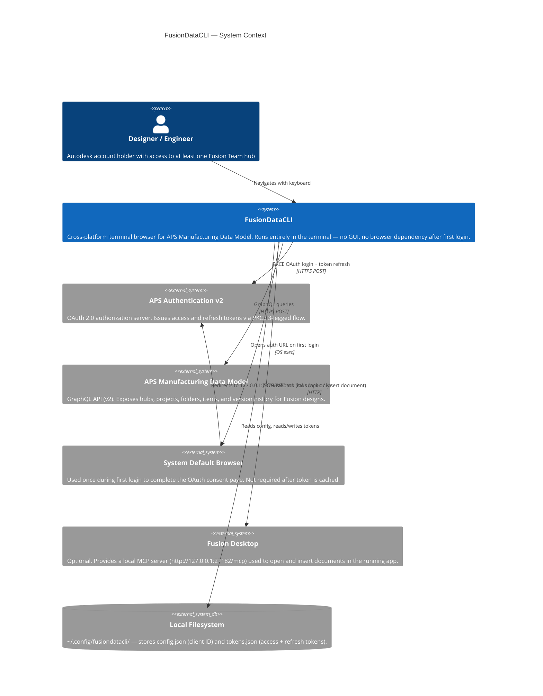
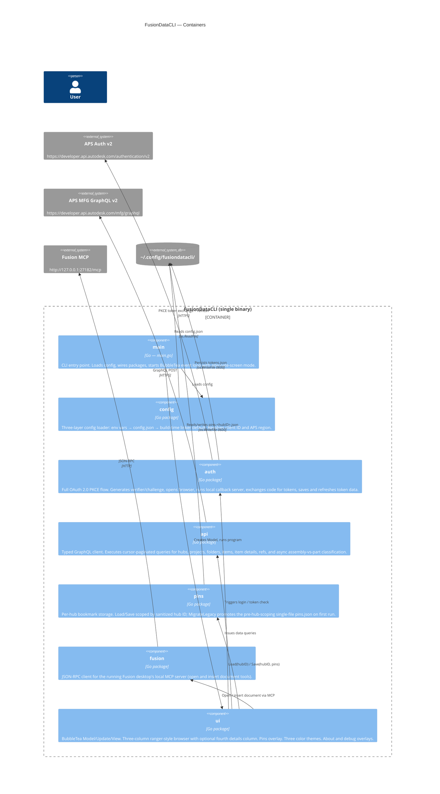
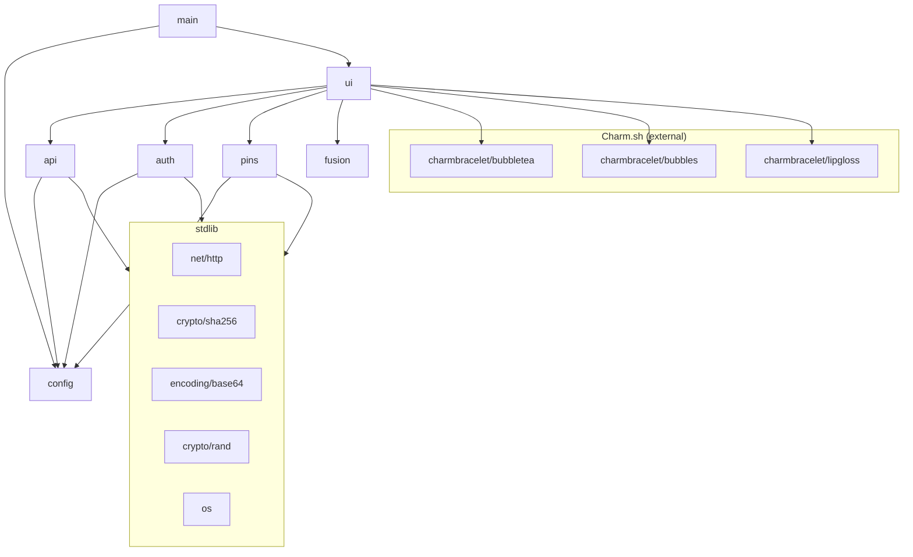
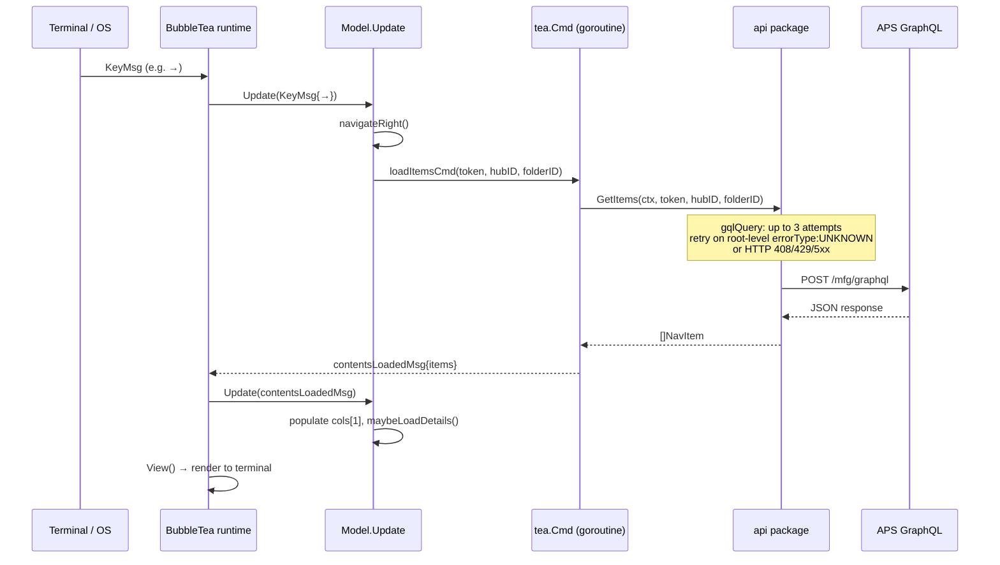
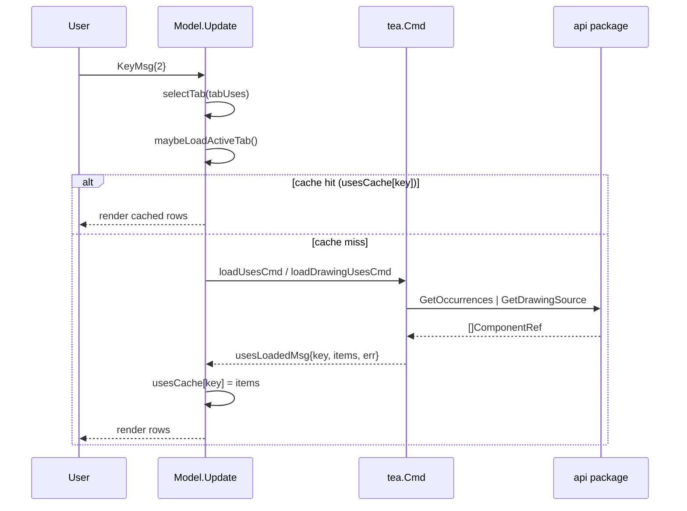
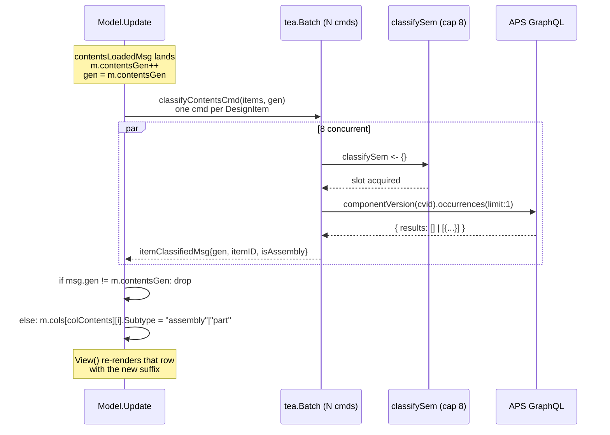

# Architecture

FusionDataCLI is a single-binary terminal application written in Go. It authenticates with Autodesk Platform Services (APS), then renders a live three-column browser over the Manufacturing Data Model hierarchy using a reactive TUI loop.

---

## System Context



---

## Container Diagram



---

## Component Diagram — `ui` package


---

## Package Dependency Graph



---

## Data Flow — From Keypress to Screen

### Hierarchy navigation (arrow keys, Enter on a folder)



### Tab activation (1-4)



### Show in Location (Enter / double-click on a tab row)

See [`docs/navigation.md`](navigation.md#tab-cursor-and-show-in-location) for the user-visible flow; the API-side detail is in [`docs/api.md`](api.md#getitemlocation--show-in-location).

### Async assembly-vs-part classification

After the Contents column loads, each DesignItem is enriched with an "assembly" / "part" subtype derived from whether its tipRootComponentVersion has any sub-component occurrences. The probe is dispatched in parallel under a `tea.Batch` and capped at 8 concurrent calls by a package-level semaphore in `api/classify.go`; each result flows back as an `itemClassifiedMsg` that mutates the matching row's `Subtype` in place. A `contentsGen` counter on the Model is incremented every time the Contents slice is replaced (folder drill, hub switch, project switch, refresh, recovery), and stale `itemClassifiedMsg`s whose gen no longer matches are dropped — late refinements can never stamp state onto a folder the user has already left.



---

## Performance Optimisations

The browser View() runs at spinner rate (~10 Hz) and re-renders every visible row each frame, so a few targeted caches keep navigation snappy on large hubs:

- **`detailsCache map[string]*api.ItemDetails`** — `GetItemDetails` results are memoised by item ID for the lifetime of the session. Item details are immutable for a given ID (a save creates a new version with a new tip-version number, but the item ID is stable), so arrowing back over a previously-visited item is served synchronously without an API call. Refresh (`r`) and hub re-selection clear the map to force re-fetch.
- **Per-tab caches** — `usesCache`, `whereUsedCache`, and `drawingsCache` each memoise their respective queries. Cache keys differ per relationship: Uses/WhereUsed for designs key on the tip root component-version id; Drawings keys on the design's lineage URN; Uses for drawings keys on the drawing's lineage URN. Hub change and refresh clear all of them; arrowing between items preserves them so a "scan Where Used across these designs" workflow doesn't refetch unchanged data.
- **`styleCache`** — Lipgloss styles are value types but their rules clone on each chained `.Width(...).Foreground(...)` call. The width-applied variants used in `renderColumn` / `viewDetailsColumn` are precomputed and rebuilt only when terminal size or theme changes. The cache is shared by pointer because Bubble Tea passes the Model by value to View(); a local mutation on a copy would not persist. The rendered detail-panel lines are also cached and keyed on `m.details`'s pointer + width + theme version.
- **Parallel project-contents fetch** — `loadProjectContentsCmd` issues `foldersByProject` and `itemsByProject` concurrently via `sync.WaitGroup` rather than sequentially. Wall-clock latency drops to roughly the slower of the two queries.
- **Bounded-parallelism assembly classifier** — `api.ClassifyAssembly` calls run under a package-level `classifySem` buffered channel (size 8). A `tea.Batch` of 50 cmds dispatched from `contentsLoadedMsg` translates into at most 8 in-flight HTTPS round-trips against the gateway at a time; the rest queue on the semaphore. Wall-clock for a 50-item folder is roughly `ceil(N/8) × ~150 ms ≈ 1 s` vs the ~5 s a serial extended `itemsByFolder` query would cost.
- **Contents generation guard** — `m.contentsGen` is incremented whenever the Contents slice is replaced. Async `itemClassifiedMsg`s carry the gen they were dispatched under; mismatches are dropped instead of mutating the new selection. This is the cancellation primitive that makes the classifier safe to fire-and-forget without per-cmd context cancellation plumbing.

---

## Resilience — APS gateway flakiness

The APS Manufacturing Data Model GraphQL gateway (`/mfg/graphql`) intermittently returns `code:NOT_FOUND, errorType:UNKNOWN` for hub URNs it just successfully enumerated via the `hubs` query — the same access token, same hub ID, and same query body succeed and fail within seconds. The failure can occur on the very first paginated request (no cursor involved), so it is not a cursor-encoding issue, and reproduces against both the shared `*http.Client` and `http.DefaultClient`, so it is not a connection-state issue.

`gqlQuery` (in `api/client.go`) wraps a single-shot `gqlQueryOnce` in a 3-attempt retry loop with backoffs `0 → 500 ms → 1.5 s`. Retry triggers are narrow:

- Transport errors and HTTP `408` / `429` / `5xx` (server / network).
- GraphQL `errors[]` carrying `extensions.errorType: "UNKNOWN"` (gateway's marker for intermittent upstream faults).

HTTP `401` and concrete-typed GraphQL errors (`VALIDATION`, `BAD_USER_INPUT`, etc.) are surfaced immediately without retry. Total worst-case added latency is ~2 s, well inside the 30 s context that wraps every nav `tea.Cmd`. See [`docs/api.md`](api.md#error-handling-and-retry) for the decision-tree diagram. The full repro trace and defect-report template live outside the repo at `~/Documents/aps-mfg-graphql-flakiness.md` for filing with APS.

---

## Test Strategy

A three-layer test pyramid lives alongside the code it exercises. The full strategy, layer-by-layer details, naming conventions, and instructions for adding new tests live in [`docs/testing.md`](testing.md).

| Layer | What it covers |
|-------|----------------|
| **L1 — Pure unit** | Config parsing, OAuth helpers, GraphQL response decode, UI helpers (no I/O) |
| **L2 — HTTP integration** | OAuth, `gqlQuery`, MCP JSON-RPC against `httptest.Server` fakes in `internal/testutil` |
| **L3 — TUI flow** | Bubble Tea `Update(msg)` / `View()` end-to-end through `tea.Cmd` → mocked APS |

The full `go test -race ./...` suite finishes in under five seconds. CI (`.github/workflows/test.yml`) runs `go vet` + `go test -race -count=1 -coverprofile` on every pull request and push to `main`; locally `make check` does the same.

---

## File Layout

```
FusionDataCLI/
├── main.go                  Entry point + deferred recover(); writes ~/.config/fusiondatacli/panic.log
│
├── config/
│   └── config.go            Config struct, Load(), Dir(), Path(), DefaultClientID
│
├── auth/
│   ├── oauth.go             Login(), Refresh(), OpenBrowser(), PKCE helpers
│   ├── callback.go          WaitForCallback() — local HTTP server bound to 127.0.0.1:7879
│   └── tokens.go            LoadTokens(), SaveTokens(), TokenData.Valid()
│
├── api/
│   ├── client.go            gqlQuery() retry loop + gqlQueryOnce(), NavItem (incl. ComponentVersionID
│   │                        + Subtype), SetRegion(), SetGraphqlEndpointForTesting()
│   ├── queries.go           Hierarchy queries — GetHubs/Projects/Folders/Items; allPages() pagination;
│   │                        items queries pull tipRootComponentVersion.id inline for designs so the
│   │                        async classifier can probe occurrences without a second round-trip
│   ├── classify.go          ClassifyAssembly(cvid) + classifySem semaphore (cap 8 concurrent)
│   ├── details.go           GetItemDetails(), ItemDetails, VersionSummary, parseTime()
│   ├── refs.go              Cross-reference queries: GetOccurrences, GetWhereUsed,
│   │                        GetDrawingsForDesign, GetDrawingSource (Uses/WhereUsed/Drawings tabs)
│   ├── locate.go            GetItemLocation — project + folder ancestry walk for Show in Location
│   ├── download.go          RequestSTEPDerivative(), DownloadFile(), StepDownloadPath()
│   └── debug.go             dbgLog (in-memory ring + debug.log file + stderr if redirected),
│                            DebugLines(), DebugEnabled(), DebugLogPath()
│
├── pins/
│   └── pins.go              Hub-scoped bookmark storage (~/.config/fusiondatacli/pins-<hubID>.json);
│                            Load(hubID), Save(hubID, pins), MigrateLegacy() (one-shot pins.json split
│                            into per-hub files), sanitizeHubID() for cross-platform filenames
│
├── fusion/
│   └── mcp.go               Fusion desktop MCP client (open / insert document)
│
├── ui/
│   ├── app.go               Model, Init, Update, View; nav + tab + Show-in-Location orchestration;
│   │                        pins overlay (statePins); async classify dispatch + contentsGen guard
│   ├── keys.go              keyMap, keys var (WASD/arrows nav, 1-4 tab select, Enter activate,
│   │                        Shift+P pin toggle, P pins overlay, Delete remove pin)
│   └── styles.go            colorTheme, themes[], applyTheme(), cycleTheme(), tab strip styles
│
├── cmd/
│   ├── probe-assembly/      One-shot diagnostic — runs the extended itemsByProject query against a
│   │                        live hub and prints assembly/part distribution. Used to validate the
│   │                        classifier schema and per-row cost. Safe to delete after decisions land.
│   └── screenshot/          Generates the README screenshot from a scripted Model state
│
├── internal/testutil/       Shared test fakes — GraphQLServer, NewMCPServer
│   ├── graphql.go           In-process APS GraphQL fake (httptest.Server)
│   └── mcp.go               In-process Fusion MCP JSON-RPC fake
│
├── docs/                    User + developer documentation
│   ├── api.md               GraphQL queries, retry behaviour, classifier, debug logging
│   ├── architecture.md      This file — C4 diagrams, packages, data flow
│   ├── authentication.md    OAuth PKCE flow
│   ├── debugging.md         End-user defect-submission guide
│   ├── development.md       Build, release, dependencies
│   ├── navigation.md        Browser, tabs, Show-in-Location, pins, mouse, themes
│   └── testing.md           Three-layer test strategy + how to extend
│
├── SECURITY-TODO.md         Pending security follow-ups (M1, M3, L1–L5)
├── .goreleaser.yaml         Build + release pipeline (goreleaser v2)
└── .github/workflows/
    ├── release.yml          GoReleaser + signed/notarized macOS .pkg on tag push
    └── test.yml             go vet + go test -race on every PR and push to main
```
