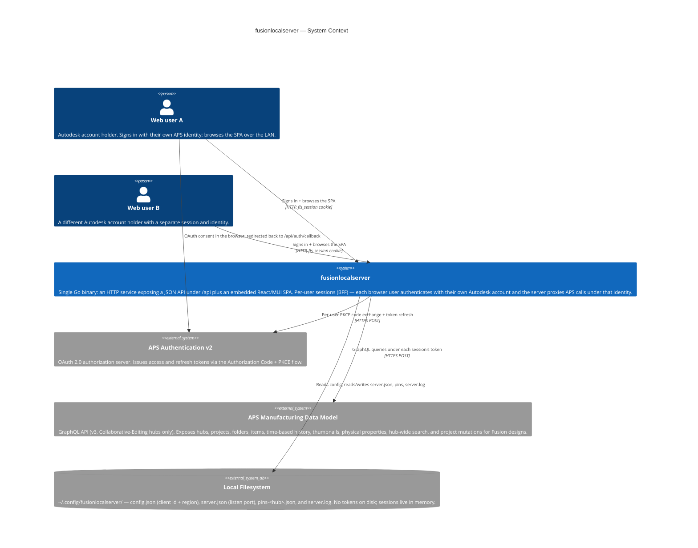
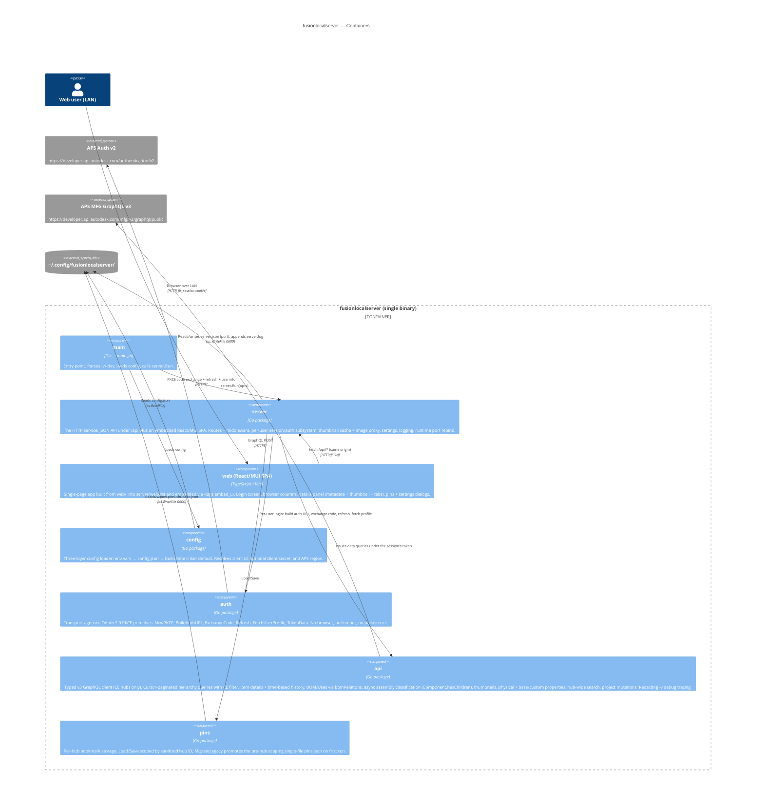
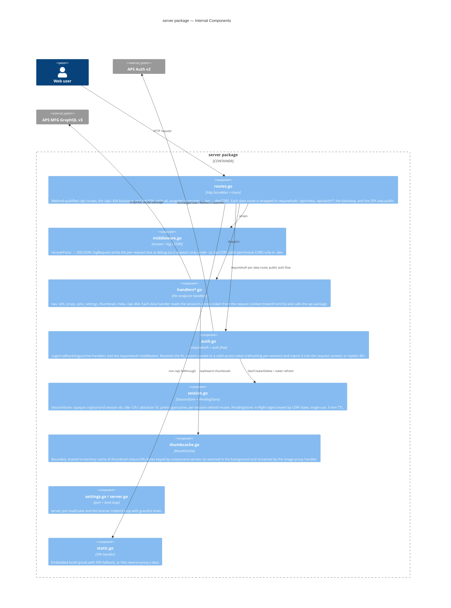
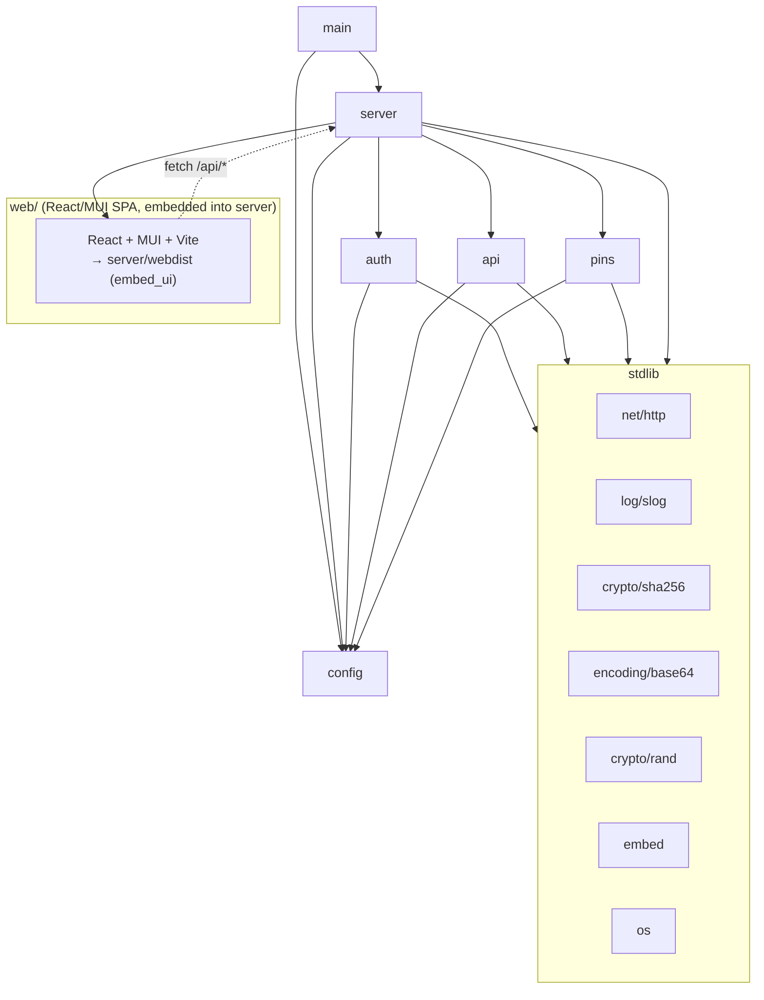
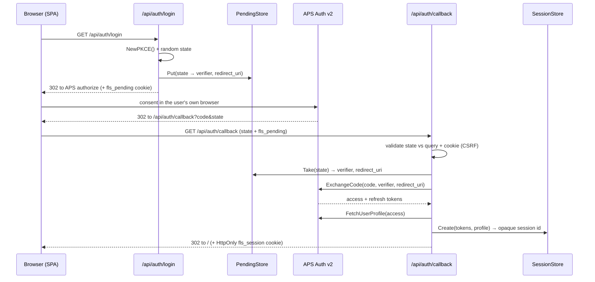
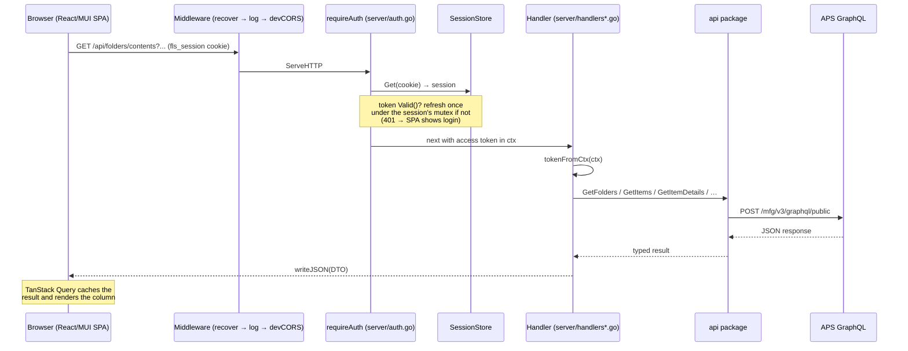
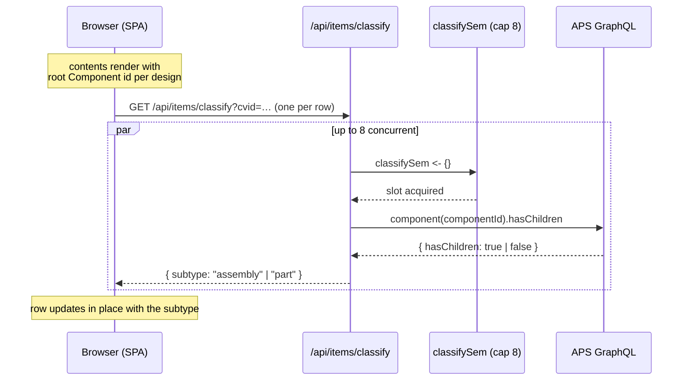

# Architecture

fusionlocalserver is a single-binary Go application that serves the Autodesk Platform Services (APS) Manufacturing Data Model hierarchy to a web browser. The binary always runs **one dedicated HTTP service** (package `server/`): a JSON API under `/api/*` plus an embedded React/MUI single-page web UI built from `web/`.

Authentication is **per user (Backend-For-Frontend)**: each browser user signs in with their own Autodesk account, the server holds that user's APS tokens in an in-memory session store, and proxies their data calls under their own identity. The browser only ever holds an opaque `HttpOnly` session cookie — APS access and refresh tokens never reach JavaScript.

The HTTP service sits on UI-agnostic layers — `api/` (APS Manufacturing Data Model GraphQL client), `auth/` (transport-agnostic OAuth PKCE primitives), `config/`, and `pins/`.

> **v3-only, CE hubs only.** The `api/` client targets the **v3** Manufacturing Data Model GraphQL endpoint (`/mfg/v3/graphql/public`) exclusively. v3 is documented as available on **Collaborative-Editing (CE) hubs only**, so `GetHubs` filters the hub list to `hubDataVersion` major version ≥ 2 and non-CE hubs are hidden. OAuth requests the wider v3 scope set (`data:read data:write data:create data:search user-profile:read`).

> The module is **pure Go standard library** — no third-party Go dependencies and no `go.sum`. The `web/` SPA's npm dependencies (React, MUI, Vite) are bundled into `server/webdist` and embedded into the binary at build time.

---

## System Context



The browser holds only the opaque `fls_session` cookie. The OAuth consent happens in the user's own browser (a top-level redirect to Autodesk and back to `/api/auth/callback`); there is no host-side browser launch and no loopback callback server.

---

## Container Diagram

`main.go` parses two flags (`-v`, `-dev`), loads config, and calls `server.Run`. There is no mode switch — the binary always runs the HTTP service.



### The server

- **Bind address.** Binds `0.0.0.0:8080` by default, so the web UI is reachable from other machines on the LAN. Each user authenticates with their own Autodesk account, but the LAN listener is plain HTTP, so the `fls_session` cookie is not `Secure`; a wire sniffer on the network could capture it and hijack that user's session. Startup logs a warning on a non-loopback bind and the reachable `http://<lan-ip>:8080` URLs. Run on a trusted LAN or front it with TLS.
- **Runtime-configurable port.** Outside `-dev` mode the listen port is owned by the server and persisted in `~/.config/fusionlocalserver/server.json`. `POST /api/settings/port` validates and saves a new port, then an in-process listener rebind drops the old listener and binds the new one without restarting the process. Sessions live in memory and span the rebind, so a port change does not log anyone out.
- **Embedded SPA vs. stub.** The React/MUI app is embedded only when built with `-tags embed_ui` (`server/static_embed.go`); a plain `go build` compiles `server/static_stub.go`, which serves a small "not built yet" shell. In `-dev` mode the static handler instead reverse-proxies non-`/api` requests to the Vite dev server for HMR.
- **Thumbnail cache + image proxy.** A bounded, shared in-memory cache (`thumbCache`) holds thumbnail status/URLs and PNG bytes keyed by component-version id. It is warmed in the background off the per-row classify probe (bounded by `warmSem`), and `/api/items/thumbnail/image` streams the bytes same-origin so browsers never fetch the cross-origin APS signed URL directly.
- **Physical properties.** `/api/items/properties` returns a design's mass/geometry properties (v3 `Component.primaryModel.physicalProperties`); generation is async, so the web UI polls until COMPLETED. `/api/items/custom-properties` adds the component's extended base properties (hub base-property definitions merged with the component's `baseProperties`) plus custom properties.
- **Search and project mutations.** `/api/search` + `/api/search/properties` run a hub-wide v3 search (`searchByHub` / `searchablePropertiesByHub`). `POST /api/projects` (create), `/api/projects/rename`, and `/api/projects/archive` drive the v3 project lifecycle mutations (require `data:write`/`data:create` scope).

### Runtime: CLI, logging, and filesystem

- **CLI flags.** Only two: `-v` (verbose — raises logging to debug) and `-dev` (reverse-proxy the UI to the Vite dev server for HMR, pinning the listen port). There is no `-server` and no `-addr`.
- **Logging.** A single `log/slog` text logger (`server/logging.go`) writes to `io.MultiWriter(os.Stdout, ~/.config/fusionlocalserver/server.log)`. The default level is **info** — essential lines only: startup, warnings, errors, and auth events. `-v` raises it to **debug**, which adds the per-request line (`server/middleware.go` `logRequest`, logged at debug) and routes the `api` package's raw GraphQL request/response tracing to the same sinks. `signedUrl` values are redacted from traces at the source. There is no in-memory ring buffer, no self-managed `debug.log`, and no `FUSIONLOCALSERVER_DEBUG` env var.
- **Filesystem.** `~/.config/fusionlocalserver/` holds `config.json` (client id + region), `server.json` (listen port), `pins-<hub>.json`, and `server.log`. Sessions and APS tokens live in memory only — there is **no `tokens.json`**, so a process restart logs everyone out.

---

## Component Diagram — `server` package

The `server` package is the only front end. Its internal pieces are the route table + middleware chain, the per-endpoint handlers, the session/auth subsystem, the thumbnail cache, the settings/port store, and the embedded-SPA static handler.



---

## Package Dependency Graph

`main` calls `server`, which depends on the shared `api` / `auth` / `config` / `pins` layers.



The whole module depends on the Go standard library only (`net/http`, `log/slog`, `embed`, `crypto/rand`, …) — no third-party Go dependencies, and consequently no `go.sum`. The `go` directive is `go 1.23`. The `web/` SPA's dependencies (React, MUI, Vite) are managed by npm and bundled into `server/webdist`, which is embedded into the binary at build time under `-tags embed_ui`.

---

## Data Flow

Every `/api/*` request runs through the middleware chain and a handler; data routes additionally pass through `requireAuth`, which resolves the session's APS token before the handler runs.

### Login (per-user OAuth Authorization Code + PKCE)



The redirect_uri is derived per request from the request origin and must be registered on the APS app (deferred APS work). The browser receives only the opaque `fls_session` cookie; the APS tokens stay in the in-memory `SessionStore`.

### Data request to JSON



A 401 from `requireAuth` is what the SPA turns into a login redirect. The SPA is served same-origin from the embedded build (or, with `-dev`, reverse-proxied to Vite), so no CORS is needed in production. The public `/api/meta` and `/api/auth/*` routes skip `requireAuth`; unmatched `/api/*` paths hit the `/api/` backstop and return a JSON 404; all other paths fall through to the SPA shell (`index.html`) so client-side deep links resolve.

### Async assembly-vs-part classification

After a folder/project's contents load, each design is enriched with an "assembly" / "part" subtype derived from the v3 `Component.hasChildren` flag (the root component has at least one direct sub-component). The probe (`api.ClassifyAssembly`, exposed as `GET /api/items/classify`) is capped at 8 concurrent calls by a package-level semaphore in `api/classify.go`. The items queries pull the root `Component` id inline for designs (`tipRootModel.component.id`), so the classifier can probe `hasChildren` without a second round-trip. The SPA dispatches one classify request per row and merges the result into the rendered list as each lands.



---

## Performance Optimisations

A few targeted optimisations keep navigation snappy on large hubs:

- **Thumbnail cache + image proxy** — the shared in-memory `thumbCache` (bounded, with TTL) holds thumbnail status/URL and PNG bytes keyed by the v3 root `Component` id, warmed in the background off the classify probe under `warmSem` (the combined `ClassifyAndThumbnail` query fetches `hasChildren` + the thumbnail in one round-trip). `/api/items/thumbnail/image` streams the bytes same-origin so each browser never re-fetches the cross-origin APS signed URL, and a second viewer of the same design is served from cache.
- **Inline classifier input** — the hierarchy items queries pull the root `Component` id inline for designs (`tipRootModel.component.id`), so the assembly/part classifier can probe `Component.hasChildren` with a single extra call per row rather than a details round-trip first.
- **Parallel project-contents fetch** — the project-contents handler issues `foldersByProject` and `itemsByProject` concurrently via `sync.WaitGroup` rather than sequentially. Wall-clock latency drops to roughly the slower of the two queries.
- **Bounded-parallelism assembly classifier** — `api.ClassifyAssembly` calls run under a package-level `classifySem` buffered channel (size 8), so at most 8 `Component.hasChildren` probes are in flight against the gateway at once; the rest queue on the semaphore. Wall-clock for a 50-item folder is roughly `ceil(N/8) × ~150 ms ≈ 1 s` vs the ~5 s a serial extended `itemsByFolder` query would cost.
- **Client-side caching** — the SPA uses TanStack Query to memoise per-item details and the Uses / Where Used / Drawings relationship queries, so re-visiting an item or scanning a relationship across several designs does not refetch unchanged data. Item details are effectively immutable for a given item id (a save creates a new version, but the item id is stable).

---

## Resilience — APS gateway flakiness

The APS Manufacturing Data Model GraphQL gateway (`/mfg/v3/graphql/public`) intermittently returns `code:NOT_FOUND, errorType:UNKNOWN` for hub URNs it just successfully enumerated via the `hubs` query — the same access token, same hub ID, and same query body succeed and fail within seconds. The failure can occur on the very first paginated request (no cursor involved), so it is not a cursor-encoding issue, and reproduces against both the shared `*http.Client` and `http.DefaultClient`, so it is not a connection-state issue.

`gqlQuery` (in `api/client.go`) wraps a single-shot `gqlQueryOnce` in a 3-attempt retry loop with backoffs `0 → 500 ms → 1.5 s`. Retry triggers are narrow:

- Transport errors and HTTP `408` / `429` / `5xx` (server / network).
- GraphQL `errors[]` carrying `extensions.errorType: "UNKNOWN"` (gateway's marker for intermittent upstream faults).

HTTP `401` and concrete-typed GraphQL errors (`VALIDATION`, `BAD_USER_INPUT`, etc.) are surfaced immediately without retry. Total worst-case added latency is ~2 s, well inside the request context that wraps every data handler. See [`docs/api.md`](api.md#error-handling-and-retry) for the decision-tree diagram. The full repro trace and defect-report template live outside the repo at `~/Documents/aps-mfg-graphql-flakiness.md` for filing with APS.

---

## Test Strategy

A three-layer test pyramid lives alongside the code it exercises. The full strategy, layer-by-layer details, naming conventions, and instructions for adding new tests live in [`docs/testing.md`](testing.md).

| Layer | What it covers |
|-------|----------------|
| **L1 — Pure unit** | Config parsing, OAuth/PKCE helpers, GraphQL response decode, session/pending store logic, thumbnail cache (no network) |
| **L2 — HTTP integration** | OAuth code exchange/refresh and `gqlQuery` against `httptest.Server` fakes (`internal/testutil/graphql.go`) |
| **L3 — Server flow** | `requireAuth` + auth handlers + data handlers exercised end-to-end through `server.routes()` with stubbed auth/api round-trips |

The full `go test -race ./...` suite finishes in under five seconds. CI (`.github/workflows/test.yml`) runs `go vet` + `go test -race -count=1 -coverprofile` on every pull request and push to `main`; locally `make check` does the same (`go vet ./...` + `go test -race ./...`).

---

## File Layout

```
fusionlocalserver/
├── main.go                  Entry point. Parses -v/-dev, loads config, calls server.Run.
│
├── config/
│   └── config.go            Config struct (ClientID, ClientSecret, Region), Load(), Dir(), Path(),
│                            DefaultClientID / DefaultRegion linker vars
│
├── auth/                    Transport-agnostic OAuth PKCE primitives — no browser, no listener,
│   │                        no persistence
│   ├── oauth.go             NewPKCE(), BuildAuthURL(), ExchangeCode(), Refresh()
│   ├── userinfo.go          FetchUserProfile() — OIDC userinfo for the logged-in display name/email
│   └── tokens.go            TokenData, TokenData.Valid() (in-memory only)
│
├── api/                     v3 ("Collaborative Editing") GraphQL client — CE hubs only
│   ├── client.go            gqlQuery() retry loop + gqlQueryOnce(), NavItem (incl. ComponentVersionID
│   │                        + Subtype), SetRegion(); v3 endpoint /mfg/v3/graphql/public
│   ├── property.go          Property — the v3 Property object ({value, displayValue}); Property.Str()
│   ├── queries.go           Hierarchy queries — GetHubs (CE filter via isCEHub)/Projects/Folders/Items;
│   │                        allPages() pagination; items queries pull the root Component id inline
│   │                        (tipRootModel.component.id) so the async classifier can probe hasChildren
│   ├── classify.go          ClassifyAssembly(componentId) via Component.hasChildren + classifySem (cap 8)
│   ├── details.go           GetItemDetails(), ItemDetails, HistoryEntry (time-based change log), parseTime()
│   ├── bom.go               GetBOM — immediate BOM via Component.bomRelations (real v3 quantity)
│   ├── refs.go              Cross-reference queries: GetOccurrences (bomRelations), GetWhereUsed
│   │                        (empty on v3 — see docs/v3-where-used.md), GetDrawingsForDesign, GetDrawingSource
│   ├── customprops.go       GetCustomProperties — hub base-property defs merged with component base + custom
│   ├── search.go            SearchByHub + GetSearchableProperties — hub-wide v3 search
│   ├── projects.go          CreateProject / RenameProject / ArchiveProject mutations
│   ├── permissions.go       GetProjectGroups / GetGroupMembers (project groups + roles)
│   ├── locate.go            GetItemLocation — project + folder ancestry walk for Show in Location
│   ├── thumbnail.go         Thumbnail status/URL query (Component.thumbnail) + ClassifyAndThumbnail + image fetch
│   ├── properties.go        Physical (mass/geometry) properties via Component.primaryModel — async, polled
│   └── debug.go             EnableDebug(io.Writer), dbgLog, redactSignedURLs() — raw GraphQL
│                            request/response tracing routed to the server's console+file sink under -v
│
├── pins/
│   └── pins.go              Hub-scoped bookmark storage (~/.config/fusionlocalserver/pins-<hubID>.json);
│                            Load(hubID), Save(hubID, pins), MigrateLegacy() (one-shot pins.json split
│                            into per-hub files), sanitizeHubID() for cross-platform filenames
│
├── server/                  The HTTP service: JSON API + embedded React/MUI SPA
│   ├── server.go            Run(), Options, listener (re)bind loop, LAN-URL/open-network warning,
│   │                        resolveAddr, graceful drain
│   ├── routes.go            ServeMux: public /api/meta + /api/auth/* + /api 404 backstop; data routes
│   │                        wrapped in requireAuth; SPA catch-all; middleware chain
│   ├── auth.go              Auth handlers (login/callback/logout/me) + requireAuth middleware; derives
│   │                        redirect_uri per request; injects the session token into the request ctx
│   ├── session.go           SessionStore (opaque ids, idle 12h / absolute 7d, per-session refresh mutex,
│   │                        janitor) + PendingStore (in-flight logins keyed by CSRF state)
│   ├── handlers*.go         Per-endpoint handlers (meta, nav, refs, props, perms, search, projects,
│   │                        pins, settings, thumbnail, /api 404)
│   ├── dto.go               JSON DTOs returned to the web client (MetaDTO, … — no fusion/step flags)
│   ├── settings.go          server.json (runtime listen port) load/save
│   ├── thumbcache.go        Bounded in-memory thumbnail status/URL/bytes cache (shared, TTL)
│   ├── logging.go           setupLogging() — slog → io.MultiWriter(stdout, server.log); -v ⇒ debug
│   ├── middleware.go        recoverPanic / logRequest (debug-level) / dev-only CORS
│   ├── respond.go           writeJSON / writeError helpers
│   ├── static.go            SPA handler: embedded build (prod) or Vite reverse-proxy (-dev)
│   ├── static_embed.go      //go:build embed_ui — go:embed server/webdist
│   └── static_stub.go       //go:build !embed_ui — "not built yet" shell
│
├── web/                     React/MUI single-page UI (Vite, TypeScript)
│   ├── src/                 App, login screen, BrowserColumns, DetailsPanel, Pins/Settings dialogs,
│   │                        api client
│   ├── vite.config.ts       Builds into ../server/webdist (gitignored build output)
│   └── package.json
│
├── cmd/
│   └── probe-assembly/      One-shot diagnostic — runs the extended itemsByProject query against a
│                            live hub and prints assembly/part distribution. Authenticates from
│                            APS_ACCESS_TOKEN (or APS_REFRESH_TOKEN + APS_CLIENT_ID). Safe to delete.
│
├── internal/testutil/
│   └── graphql.go           In-process APS GraphQL fake (httptest.Server)
│
├── docs/                    User + developer documentation
│   ├── api.md               v3 JSON API + GraphQL queries, retry behaviour, classifier, debug logging
│   ├── architecture.md      This file — C4 diagrams, packages, data flow
│   ├── authentication.md    Per-user OAuth Authorization Code + PKCE (BFF) flow
│   ├── web-ui.md            Web UI: login, browser, tabs, search, project mutations, pins, settings
│   ├── development.md       Build, release, dependencies
│   ├── debugging.md         End-user defect-submission guide
│   ├── testing.md           Three-layer test strategy + how to extend
│   ├── v3-where-used.md     Why Where-Used returns empty on v3 + options
│   └── server-webui-plan.md Historical: original server + React/MUI web UI design record
│
├── Makefile                 build (vite build → embed_ui → ldflags), install, run, dev, check
├── SECURITY-TODO.md         Pending security follow-ups
├── .goreleaser.yaml         Build + release pipeline (goreleaser v2)
└── .github/workflows/
    ├── release.yml          GoReleaser + signed/notarized macOS .pkg on tag push
    └── test.yml             go vet + go test -race on every PR and push to main
```
