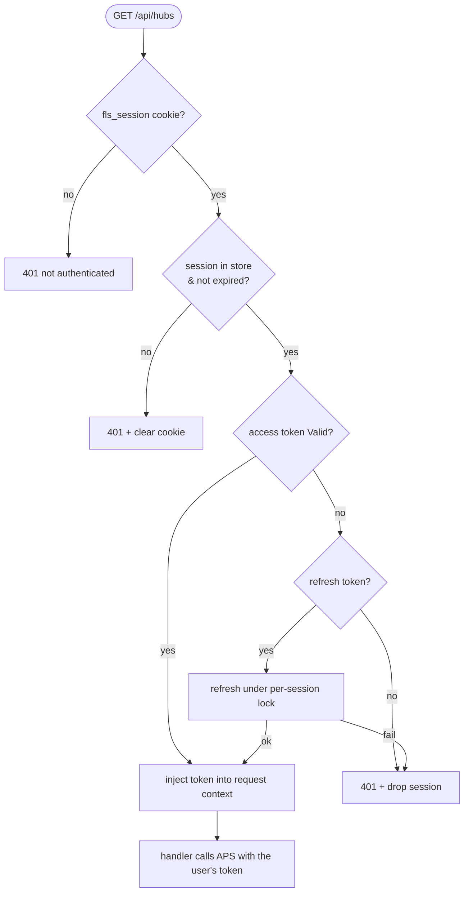
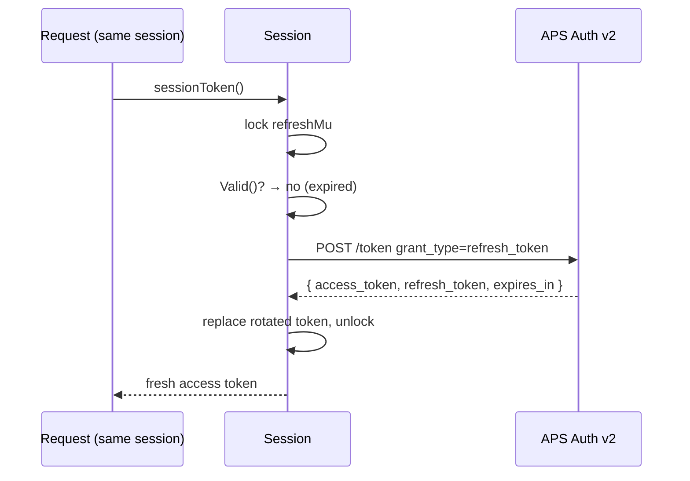

# Authentication

fusionlocalserver logs **each user in with their own Autodesk account** using the
**OAuth 2.0 Authorization Code flow with PKCE** (Proof Key for Code Exchange). It
follows the Backend-For-Frontend (BFF) pattern: the browser holds only an opaque
`HttpOnly` session cookie, while the APS access and refresh tokens live
server-side in an in-memory session store and never reach JavaScript. The server
proxies each user's data calls under that user's own identity.

No client secret is required for a public APS app registration; a confidential
app is supported too (see [Client Authentication Modes](#client-authentication-modes)).

---

## Overview

PKCE prevents authorization-code interception by binding the code exchange to a
random one-time secret that never leaves the server. A separate `state` value
protects the redirect step against CSRF. The parties are the user's browser, the
fusionlocalserver process (which owns both the authorize redirect and the
callback endpoint), and APS.

The server exposes four auth endpoints, all same-origin under `/api/auth`:

| Endpoint | Method | Public | Purpose |
|----------|--------|--------|---------|
| `/api/auth/login` | GET | yes | Start a login: mint PKCE + `state`, 302 to APS authorize |
| `/api/auth/callback` | GET | yes | APS redirect target: validate `state`, exchange code, create session |
| `/api/auth/logout` | POST | yes | Drop the session, clear the cookie |
| `/api/auth/me` | GET | yes | Login-state probe for the SPA (`{authenticated, user?}`) |

Every other `/api/*` data route is gated by `requireAuth` (see below). `/api/meta`
and the SPA assets stay public so the login screen can load.

---

## Login — full PKCE flow

```mermaid
sequenceDiagram
    autonumber
    participant B as User's Browser
    participant App as fusionlocalserver
    participant PS as PendingStore (in-memory)
    participant SS as SessionStore (in-memory)
    participant APS as APS Auth v2

    B->>App: GET /api/auth/login
    App->>App: verifier, challenge = NewPKCE()
    App->>App: state = random 32 bytes
    App->>PS: store {state → verifier, redirect_uri}
    App-->>B: 302 to authorize URL<br/>Set-Cookie: fls_pending=<state>; HttpOnly; SameSite=Lax
    B->>APS: GET /authentication/v2/authorize<br/>?client_id&response_type=code&redirect_uri<br/>&scope=data:read data:write data:create data:search user-profile:read&state<br/>&code_challenge&code_challenge_method=S256
    APS->>B: Autodesk login + consent
    B->>APS: credentials
    APS-->>B: 302 → <origin>/api/auth/callback?code&state
    B->>App: GET /api/auth/callback?code&state (sends fls_pending cookie)
    App->>App: require state == fls_pending cookie
    App->>PS: Take(state) → {verifier, redirect_uri} (single-use)
    App->>APS: POST /authentication/v2/token<br/>grant_type=authorization_code&code&redirect_uri<br/>&code_verifier&client_id
    APS-->>App: { access_token, refresh_token, expires_in }
    App->>APS: GET /userinfo (best-effort, for display)
    App->>SS: Create session {tokens, profile} → random session id
    App-->>B: Set-Cookie: fls_session=<id>; HttpOnly; SameSite=Lax<br/>302 → /
```

**`redirect_uri`.** With `-public-url` set, the callback is fixed to
`<public-url>/api/auth/callback` and a middleware redirects any client that
arrives via a different host to the canonical origin first — so the whole flow
stays same-origin and **only that one callback need be registered on the APS
app**. Without `-public-url` the callback is derived per request from the origin
the browser used (`<scheme>://<host>/api/auth/callback`), which then requires
**every** such origin to be registered (`localhost` ≠ `127.0.0.1`, each LAN
IP/hostname is distinct, and `-tls` makes it `https`). Either way the value
chosen at `/login` is stored in the pending entry and replayed byte-for-byte at
the token exchange (APS rejects a mismatch). See
[`SECURITY-TODO.md`](../SECURITY-TODO.md).

On any failure the callback redirects to `/?auth_error=<reason>`, which the
login screen turns into a readable message.

---

## Authenticated requests — the `requireAuth` gate



`requireAuth` resolves the `fls_session` cookie to a live session, ensures the
access token is valid (refreshing if needed), and places the token in the
request context. Handlers read it via the unchanged `s.token(ctx, …)` helper. A
401 from any data call is what the SPA turns into a login redirect.

---

## Sessions and token refresh

- **Session store** (`server/session.go`) — an in-memory map keyed by an opaque
  256-bit `crypto/rand` id. Each session carries the user's `TokenData`, a
  display profile, and idle/absolute deadlines (12h idle, 7d absolute). A
  janitor sweeps expired sessions; `Get` also evicts on access.
- **Per-session refresh.** APS rotates the refresh token on every use, so a
  double refresh of one session would invalidate it. Each session has its own
  mutex; the refresh path re-checks `TokenData.Valid()` under the lock, so
  concurrent requests on the same session perform **at most one** refresh and
  the rest observe the freshly-minted token. Unrelated sessions never block each
  other.
- **Persisted, encrypted.** The store is mirrored to
  `~/.config/fusionlocalserver/sessions.enc` (AES-256-GCM, key in `session.key`
  mode 0600), written on create/delete/sweep and after a refresh and reloaded at
  startup — so a restart no longer logs everyone out (expired sessions are
  dropped on load). This is encryption-at-rest of refresh tokens, not OS-keychain
  storage; see [`SECURITY-TODO.md`](../SECURITY-TODO.md).



---

## Cookies

| Cookie | Set at | Lifetime | Attributes |
|--------|--------|----------|------------|
| `fls_pending` | `/api/auth/login` | ~5 min | `HttpOnly`, `SameSite=Lax`, `Path=/` |
| `fls_session` | `/api/auth/callback` | up to the absolute session TTL | `HttpOnly`, `SameSite=Lax`, `Path=/` |

- **`HttpOnly`** — the cookie is never readable from JavaScript; APS tokens stay
  server-side. This is the whole point of the BFF pattern.
- **`SameSite=Lax`** (not `Strict`) — required: the OAuth callback is a top-level
  cross-site navigation from `autodesk.com`, which `Strict` would drop.
- **`Secure`** — set from `r.TLS` (or `X-Forwarded-Proto: https`). Over plain HTTP
  it is therefore **off**, because browsers refuse to store `Secure` cookies on
  `http://`. Run with **`-tls`** (or behind a TLS-terminating proxy) and the same
  binary auto-hardens — the cookie becomes `Secure` and the redirect_uri scheme
  becomes `https`. On plain HTTP a wire sniffer on the LAN could capture a cookie
  and hijack a session, so run on a trusted LAN or enable TLS.

---

## PKCE cryptographic details

| Step | Algorithm | Implementation |
|------|-----------|----------------|
| Verifier generation | `crypto/rand` — 64 bytes | `NewPKCE()` → base64url (no padding) |
| Challenge derivation | SHA-256 → base64url | `verifierToChallenge(verifier)` |
| Challenge method | `S256` | Sent as query parameter to `/authorize` |
| `state` (CSRF) | `crypto/rand` — 32 bytes | Stored server-side + echoed in `fls_pending` |
| Session id | `crypto/rand` — 32 bytes | Generated only on successful login |

---

## Endpoints

| Purpose | URL |
|---------|-----|
| Authorization | `https://developer.api.autodesk.com/authentication/v2/authorize` |
| Token exchange / refresh | `https://developer.api.autodesk.com/authentication/v2/token` |
| User profile (display) | `https://api.userprofile.autodesk.com/userinfo` |
| Redirect receiver | `<public-url>/api/auth/callback` when `-public-url` is set (one registration), else `<server-origin>/api/auth/callback` derived per request; must be registered on the APS app |

**Required scopes:** `data:read data:write data:create data:search user-profile:read`

The v3 Manufacturing Data Model needs the wider data scope set: `data:read` for browsing, `data:search` for the hub-wide search (`searchByHub` / `searchablePropertiesByHub`), and `data:write` + `data:create` for the project create/rename/archive mutations. Because this is wider than the old v2 `data:read user-profile:read` set, every user must re-consent (sign in again) **once** for the new scopes to take effect. The `authentication/v2` Auth API version is unchanged — only the requested scope changed.

---

## Client authentication modes

APS supports both public and confidential app registrations.

| Mode | How the client is identified | When to use |
|------|------------------------------|-------------|
| **Public client** (default) | `client_id` in the POST form body | No server-side secret storage |
| **Confidential client** | HTTP Basic Auth (`client_id:client_secret`) | When you provision a client secret |

The server detects which to use automatically:
- If `APS_CLIENT_SECRET` / `client_secret` is configured → confidential (Basic Auth, no form `client_id`).
- Otherwise → public client (form body only).

---

## Security notes

- The `code_verifier` and `state` are generated fresh per login and never logged.
- The session id is minted only **after** a successful code exchange, so a login
  cannot fixate a session id.
- Pending logins are single-use and short-lived (~5 min); a replayed callback
  finds no entry and is rejected, and APS also rejects a reused authorization code.
- Verbose tracing (`-v`) logs API request/response bodies but never tokens —
  `Authorization` headers aren't traced, and `signedUrl` values are redacted.
- Tokens live only in server memory; there is no on-disk token file.

For the remaining hardening items (TLS/`Secure` cookie, session persistence, APS
callback registration), see [`SECURITY-TODO.md`](../SECURITY-TODO.md).
