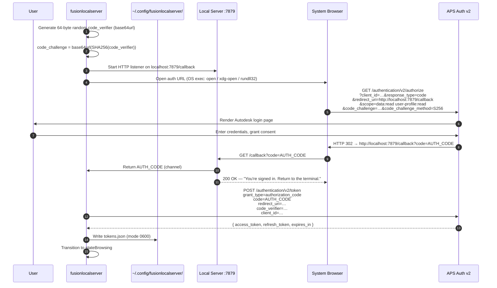
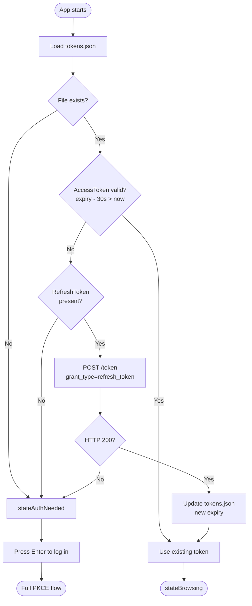
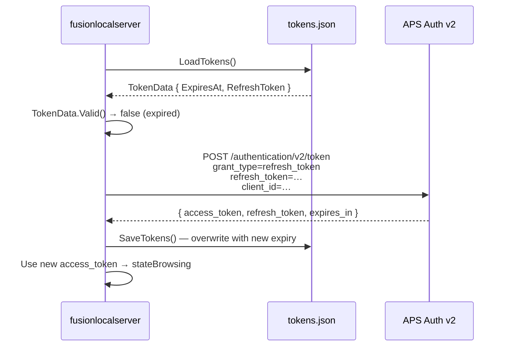
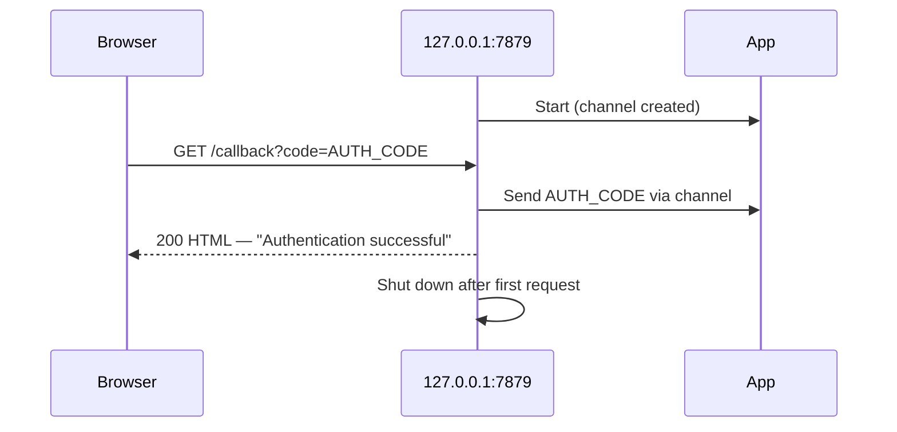

# Authentication

fusionlocalserver uses the **OAuth 2.0 Authorization Code flow with PKCE** (Proof Key for Code Exchange), which is the recommended approach for CLI and native applications. No client secret is required when using a public APS app registration.

The same `auth` package backs both front ends. In the TUI, login is triggered interactively from the browser screen. In `-server` mode the login runs **once at startup on the server host** (`TokenManager.Bootstrap`): a still-valid cached token is reused as-is, an expired one with a refresh token is refreshed, and otherwise a browser opens on the host for an interactive login before the listener binds. After that, every web client shares that one cached APS identity — there is no per-user login.

---

## Overview

PKCE prevents authorization code interception by binding the code exchange to a random one-time secret that never leaves the device. The flow involves three parties: the user, the app (acting as both initiator and redirect receiver), and APS.

---

## First Login — Full PKCE Flow



---

## Subsequent Launches — Token Validation



---

## Token Refresh Flow



---

## PKCE Cryptographic Details

| Step | Algorithm | Implementation |
|------|-----------|----------------|
| Verifier generation | `crypto/rand` — 64 bytes | `newVerifier()` → base64url (no padding) |
| Challenge derivation | SHA-256 → base64url | `verifierToChallenge(verifier)` |
| Challenge method | `S256` | Sent as query parameter to `/authorize` |
| Token storage | JSON file | `~/.config/fusionlocalserver/tokens.json`, mode `0600` |

---

## Endpoints

| Purpose | URL |
|---------|-----|
| Authorization | `https://developer.api.autodesk.com/authentication/v2/authorize` |
| Token exchange / refresh | `https://developer.api.autodesk.com/authentication/v2/token` |
| Local redirect receiver | `http://localhost:7879/callback` |

**Required scopes:** `data:read user-profile:read`

---

## Client Authentication Modes

APS supports both public and confidential app registrations.

| Mode | How client is identified | When to use |
|------|--------------------------|-------------|
| **Public client** (default) | `client_id` in POST form body | CLI tools, no server-side secret storage |
| **Confidential client** | HTTP Basic Auth (`client_id:client_secret`) | Server-side apps with secure secret storage |

fusionlocalserver detects which mode to use automatically:
- If `APS_CLIENT_SECRET` / `client_secret` in config → confidential (Basic Auth, no form client_id)
- Otherwise → public client (form body only)

---

## Local Callback Server

The callback server (`auth/callback.go`) is a minimal HTTP server:



- **Binds explicitly to `127.0.0.1`** (loopback only) via `net.Listen("tcp", "127.0.0.1:7879")`. Never accessible from the network — no other process on the LAN can intercept the auth code, even on a misconfigured firewall. (Earlier versions bound to all interfaces; that was tightened as security finding **H1**.)
- Shuts down after receiving the first valid callback
- Returns a human-readable HTML page so the browser tab shows a clear success state
- Error responses from APS (`?error=access_denied&error_description=…`) are surfaced to the user. The reflected `error` and `error_description` query parameters are **HTML-escaped** with `html.EscapeString` before being written into the response page (XSS defense — without escaping, a malicious authorize-URL crafter could inject script into the page that runs in the browser).

---

## Token File Format

`~/.config/fusionlocalserver/tokens.json`:

```json
{
  "access_token": "eyJhbGciOiJSUzI1NiIsImtpZCI6...",
  "refresh_token": "LmFv...",
  "expires_at": "2026-04-01T15:04:05Z"
}
```

The file is written with mode `0600` (owner read/write only). `expires_at` is computed as `time.Now().Add(time.Duration(expiresIn) * time.Second)` at the moment the token is received.

---

## Security Notes

- The `code_verifier` is generated fresh on every login — it is never stored or logged
- Tokens are stored in the user config directory (`os.UserConfigDir()`), not in the project directory
- Debug mode (`FUSIONLOCALSERVER_DEBUG=1`) logs API request/response bodies but **does not log tokens** — `Authorization` header values are not included in debug output
- Port 7879 is used only during the OAuth callback window; the server stops immediately after receiving one valid request
- The OAuth callback listener binds to `127.0.0.1` only, never `0.0.0.0` (H1)
- Reflected `error` / `error_description` query params on the callback page are HTML-escaped (XSS defense)

---

## Security Hardening (PR #1)

Three findings from the 2026-05-02 security review shipped together:

| ID | Finding | Mitigation |
|----|---------|------------|
| **H1** | Callback listener bound to all interfaces; reflected error params unescaped | Bind explicitly to `127.0.0.1`; `html.EscapeString` the reflected query params |
| **H2** | `api.DownloadFile` attached the bearer token to signed-URL downloads | Removed the `token` parameter from the signature. Signed URLs are self-authenticated (signature embedded in the URL); attaching the bearer would leak the user's APS access token if the URL was ever poisoned or MITM'd. |
| **M2** | Fusion MCP `InsertDocument` built a Python script via hand-rolled string escaping of `fileId` | `validFileID` whitelist regex `^[A-Za-z0-9._:\-]+$` rejects anything outside the URL-safe APS lineage URN charset. The script-construction path now uses `json.Marshal` (JSON string syntax is a strict subset of Python string syntax, so the result is always a valid Python literal — no ad-hoc escaping). The same whitelist is applied to `OpenDocument`. |

### Pending follow-ups

Tracked in [`SECURITY-TODO.md`](../SECURITY-TODO.md) at the repo root. The most relevant authentication-layer item:

- **M1. Add `state` parameter to OAuth flow** — PKCE already prevents code-injection (the verifier is local), but `state` is the standard CSRF defense for the redirect step (RFC 6749 §10.12, RFC 9700) and costs nothing. Will be plumbed through `Login` → `buildAuthURL` → `WaitForCallback`.

The remaining items (M3, L1–L5) cover signed-URL redaction in debug logs, OS-keychain token storage, browser-URL scheme validation, and dependency bumps.
