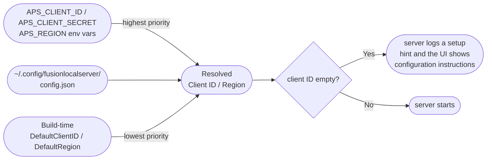
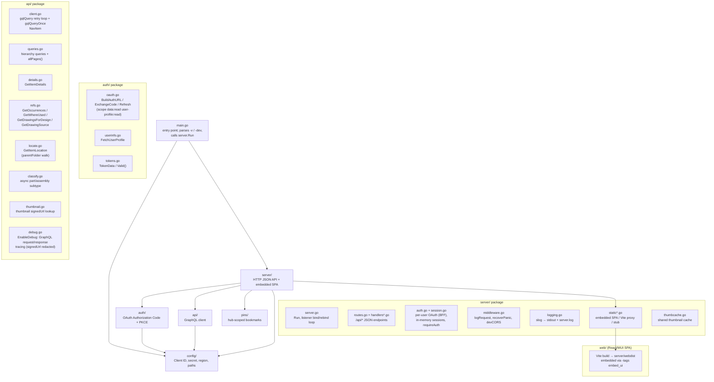

# Development

Everything needed to build, run, test, and release fusionlocalserver from source.

The binary is a single dedicated HTTP server: a JSON API under `/api` plus an embedded React/MUI single-page web UI. There is no separate mode — running the binary always starts the server. Building the web UI (and embedding it) requires Node/npm in addition to the Go toolchain.

---

## Requirements

| Tool | Version | Purpose |
|------|---------|---------|
| Go | 1.23+ | Build and run (the `go` directive in `go.mod` is `go 1.23`) |
| Node + npm | LTS | Build the `web/` React/MUI UI |
| goreleaser | v2 | Cross-platform release builds |
| git | any | Version tags trigger releases |
| An APS app registration | — | Client ID for OAuth |

---

## APS App Registration

Each browser user signs in with their own Autodesk account via OAuth (Authorization Code + PKCE, backend-for-frontend). Register a **web app** at [aps.autodesk.com/myapps](https://aps.autodesk.com/myapps):

- **App type:** Web app
- **Scopes:** `data:read`, `user-profile:read`
- **Callback URL:** one per origin that users reach the server by. The server derives `redirect_uri` from the request's origin as `<origin>/api/auth/callback`, so register a Callback URL for each origin. For local development that is:

  ```
  http://localhost:8080/api/auth/callback
  ```

  Add the LAN URLs (e.g. `http://<lan-ip>:8080/api/auth/callback`) and any TLS-terminated public hostnames the same way.

Copy the **Client ID** (and **Client Secret** if your app registration issues one — it is read from `APS_CLIENT_SECRET` / `config.json` when present). Sessions live in server memory; there is no on-disk token file.

---

## Configuration

### Environment variables (recommended for development)

```sh
export APS_CLIENT_ID=your-client-id
export APS_CLIENT_SECRET=your-client-secret   # only if your web app issues one
export APS_REGION=EMEA                          # optional — US default
```

`APS_REGION` is process-global: it applies to every signed-in user, not per session.

### Config file (persistent)

```sh
mkdir -p ~/.config/fusionlocalserver
cat > ~/.config/fusionlocalserver/config.json <<EOF
{
  "client_id": "your-client-id",
  "region": "US"
}
EOF
```

### Build-time default (for distributable binaries)

The published binaries embed a default client ID via linker flags:

```sh
go build -ldflags "-X github.com/schneik80/fusionlocalserver/config.DefaultClientID=<id>" .
```

Users of the published binary need no configuration — the embedded client ID is used automatically.

### Config resolution order

The same precedence resolves both the client ID/secret and the region (`config.Load`):



There is no `tokens.json` — per-user sessions are held in server memory only.

---

## Building

The Makefile is the supported build path — it injects the APS `client_id` (and region) via `-ldflags`, runs the web build, and sets the `embed_ui` tag so the binary ships the React/MUI UI. Store your client ID in a git-ignored `.aps-client-id` file (or pass `CLIENT_ID=` on the command line); a region can go in `.aps-region`.

```sh
# Clone
git clone https://github.com/schneik80/fusionlocalserver
cd fusionlocalserver
echo your-client-id > .aps-client-id          # or pass CLIENT_ID= to make

# Production build: vite build → go build -tags embed_ui (embedded UI + client_id)
make build                                     # produces ./fusionlocalserver
make install                                   # same, into $GOPATH/bin

# Build and serve (binds 0.0.0.0:8080 by default; change the port from the
# web UI's Settings dialog). Startup logs the reachable LAN URLs.
make run                                        # = make build, then serve
make run ARGS="-v"                             # add flags (here: verbose logging)

# Dev build: no embedded UI, no embedded client_id (stub UI shell).
# Pair with the Vite dev server for HMR:
make dev                                        # go build (untagged, Go-only)
cd web && npm run dev                           # Vite on :5173, separate terminal
APS_CLIENT_ID=your-id ./fusionlocalserver -dev  # reverse-proxies the UI to Vite
```

> `make build` overwrites `server/webdist/index.html` with a built shell that references gitignored hashed assets. The whole `server/webdist/` tree is gitignored build output — restore the committed placeholder before committing.

A plain `go build` (no `embed_ui` tag) still produces a working server; it serves the in-memory "not built yet" stub UI (`server/static_stub.go`) instead of the embedded SPA. That is what `make dev` produces — pair it with `npm run dev` and `-dev` so the Go server reverse-proxies the live Vite UI.

---

## Project Structure



---

## Flags

The binary takes exactly two flags:

| Flag | Effect |
|------|--------|
| `-v` | Verbose logging: raises the log level from info to debug, on **both** the console (stdout) and the log file. Adds a line per HTTP request and the `api` package's GraphQL request/response traces. |
| `-dev` | Developer mode: reverse-proxy the web UI to the Vite dev server (`:5173`) for HMR instead of serving the embedded/stub SPA. |

There is no `-server` flag (the binary always serves) and no `-addr` flag (the listen port is changed from the web UI's Settings dialog, defaulting to `0.0.0.0:8080`).

---

## Logging

A single `log/slog` logger (see `server/logging.go`) writes to **both** the console (stdout) and `~/.config/fusionlocalserver/server.log` (mode `0600`, appended). The default level is **info** — essential lines only: startup URLs, warnings, errors, and auth events. `-v` raises it to debug, adding a structured line per request (method, path, status, duration, remote IP) and the `api` package's GraphQL request/response traces.

Tokens and `Authorization` headers are never logged, and `signedUrl` values are redacted from traces. A panic in any handler is recovered, logged with its stack, and returned to the client as a JSON 500 rather than crashing the process.

End users reporting bugs should follow [`docs/debugging.md`](debugging.md), which walks through what to capture and how to file a defect.

---

## Test Suite

```sh
make check        # go vet ./... + go test -race ./...
go test -race -count=1 -coverprofile=coverage.out ./...
go tool cover -func=coverage.out
```

`make check` is what CI runs on every pull request and push to `main` (`.github/workflows/test.yml`). The full suite finishes in under five seconds.

The full test architecture — layer breakdown, fixtures, naming conventions, the const→var injection pattern, and how to extend the suite — is documented in [`docs/testing.md`](testing.md).

---

## Dependencies

The Go module has **no third-party dependencies** — auth, the HTTP server, logging, and UI embedding are all built on the Go standard library (`net/http`, `log/slog`, `crypto/*`, `embed`). Removing the Bubble Tea TUI dropped every external Go dependency, so there is **no `go.sum`** and `go.mod` is just the module path plus the `go 1.23` directive.

```sh
go mod tidy     # keeps go.mod tidy (no go.sum to sync — pure stdlib)
```

The web UI has its own npm dependency tree under `web/` — React, MUI, TanStack Query, and Vite — bundled into `server/webdist` at build time and embedded into the binary. It is independent of the Go module graph.

```sh
cd web && npm install   # sync web/ dependencies (package-lock.json)
```

---

## Release Pipeline

```mermaid
flowchart TD
    Dev([Developer]) -- "git tag v0.x.y\ngit push origin v0.x.y" --> GH[GitHub]
    GH -- "tag push event" --> Actions[GitHub Actions\nrelease.yml]

    subgraph "release job"
        Actions --> Checkout[actions/checkout]
        Checkout --> SetupGo[actions/setup-go]
        SetupGo --> GoReleaser[goreleaser/goreleaser-action v6]
        GoReleaser --> Builds["Build 5 binaries\ndarwin/amd64\ndarwin/arm64\nlinux/amd64\nlinux/arm64\nwindows/amd64"]
        Builds --> Archives["Create archives\nfusionlocalserver-{ver}-{os}-{arch}.tar.gz\nfusionlocalserver-{ver}-windows-amd64.zip"]
        Archives --> Checksums[checksums.txt]
        Archives --> GHRelease[GitHub Release\nv{version}]
        GHRelease --> BrewFormula["Push formula to\nschneik80/homebrew-fusionlocalserver\nFormula/fusionlocalserver.rb"]
    end

    subgraph "mac-installer job (needs: release)"
        MIChk[checkout] --> MISetup[setup-go]
        MISetup --> MICert["Import Apple\nDeveloper ID certificate"]
        MICert --> MIBuild["Build universal binary\n(arm64 + amd64 → lipo)"]
        MIBuild --> MISign["codesign --options runtime\nDeveloper ID Application"]
        MISign --> MIPkg["pkgbuild + productsign\nDeveloper ID Installer"]
        MIPkg --> MINotary["xcrun notarytool submit\n--wait, then stapler staple"]
        MINotary --> MIUpload["Upload signed/notarized\n.pkg to GitHub release"]
    end
```

### Triggering a release

```sh
git tag v0.1.0
git push origin v0.1.0
```

The workflow fires automatically. No manual steps needed.

### macOS .pkg installer

The `mac-installer` job runs after the main `release` job and produces a signed, notarized `.pkg` for macOS:

1. Build a universal binary (`arm64` + `amd64` joined via `lipo`)
2. Codesign the binary with a `Developer ID Application` identity (hardened runtime, secure timestamp)
3. `pkgbuild` the payload to install at `/usr/local/bin/fusionlocalserver`, then `productsign` with a `Developer ID Installer` identity
4. Submit to Apple's notary service via `xcrun notarytool submit --wait` and `stapler staple` the ticket
5. Upload `fusionlocalserver-<version>-darwin-universal.pkg` to the GitHub release

End users can double-click the `.pkg` and install without Gatekeeper warnings.

### Required GitHub secrets

| Secret | Purpose |
|--------|---------|
| `GITHUB_TOKEN` | Auto-provided by Actions — creates the release |
| `APS_CLIENT_ID` | Embedded into binaries at build time via ldflag |
| `HOMEBREW_TAP_GITHUB_TOKEN` | PAT with `repo` scope on `homebrew-fusionlocalserver` tap |
| `APPLE_CERTIFICATE_P12` | Base64-encoded `.p12` containing both Developer ID Application + Installer identities |
| `APPLE_CERTIFICATE_PASSWORD` | Password for the `.p12` |
| `APPLE_ID` | Apple ID for notarytool submission |
| `APPLE_ID_PASSWORD` | App-specific password for the Apple ID |
| `APPLE_TEAM_ID` | Apple Developer Team ID for notarization |

### Goreleaser config highlights (`.goreleaser.yaml`)

| Setting | Value | Why |
|---------|-------|-----|
| `project_name` | `fusionlocalserver` | Sets archive filename casing — must match homebrew formula URL expectations |
| `binary` | `fusionlocalserver` | Binary name installed into `$PATH` |
| `ldflags` | `-s -w -X main.version -X config.DefaultClientID` | Strip debug info, embed version + client ID |
| `CGO_ENABLED=0` | yes | Pure Go, no C dependencies — enables full cross-compilation |
| `ignore` | `windows/arm64` | Not yet supported |
| `brews.directory` | `Formula` | Formula output directory in the tap repo |

---

## Homebrew Tap

The tap repo is [github.com/schneik80/homebrew-fusionlocalserver](https://github.com/schneik80/homebrew-fusionlocalserver).

goreleaser generates `Formula/fusionlocalserver.rb` after each release with:
- Explicit `version "x.y.z"` field (prevents Homebrew from misdetecting the version from the archive filename)
- Per-platform binary URLs with SHA-256 checksums
- `bin.install "fusionlocalserver"` install block

```sh
# Install
brew install schneik80/fusionlocalserver/fusionlocalserver

# Upgrade
brew update && brew upgrade fusionlocalserver

# Verify
brew info fusionlocalserver
```

---

## Version String

The binary version is set at build time:

```sh
# In goreleaser
-X main.version={{ .Version }}

# In dev builds
-X main.version=dev

# Access in code
var version = "dev"   // overwritten by ldflag
```

The version is logged at startup and returned by `GET /api/meta` (the web UI surfaces it in its About dialog). The current series is **v0.1.0**.

---

## Changelog

goreleaser generates the changelog from git commit messages. Commits are filtered:

| Prefix | Included in changelog? |
|--------|----------------------|
| `feat:` | ✓ |
| `fix:` | ✓ |
| `refactor:` | ✓ |
| `docs:` | ✗ |
| `test:` | ✗ |
| `chore:` | ✗ |
| Merge commits | ✗ |

Use [Conventional Commits](https://www.conventionalcommits.org/) style for clean release notes.
