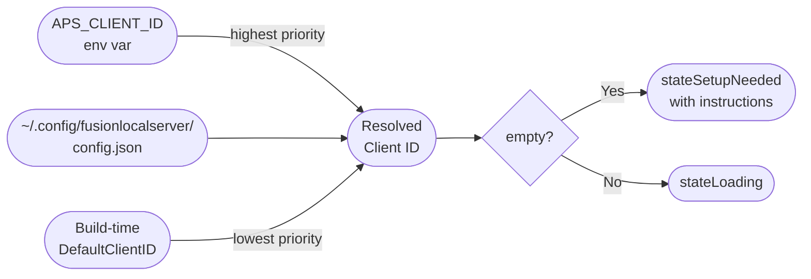
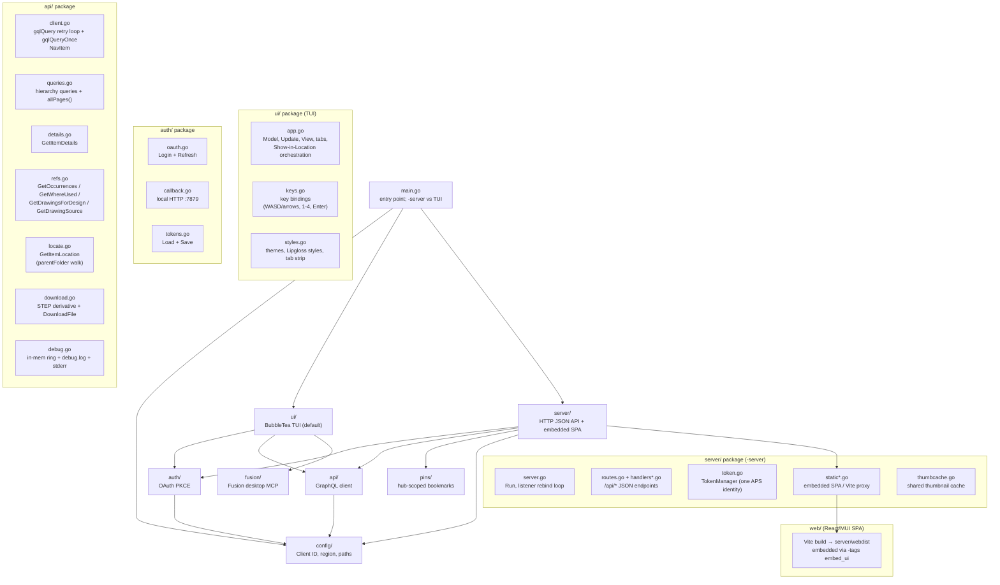

# Development

Everything needed to build, run, test, and release fusionlocalserver from source.

The binary has two modes: the default Bubble Tea **TUI**, and `fusionlocalserver -server`, which serves a JSON API plus an embedded React/MUI web UI. Building the web UI (and embedding it) requires Node/npm in addition to the Go toolchain.

---

## Requirements

| Tool | Version | Purpose |
|------|---------|---------|
| Go | 1.22+ | Build and run |
| Node + npm | LTS | Build the `web/` React/MUI UI (only for `-server` mode) |
| goreleaser | v2 | Cross-platform release builds |
| git | any | Version tags trigger releases |
| An APS app registration | — | Client ID for OAuth |

---

## APS App Registration

Register a **public client** app at [aps.autodesk.com/myapps](https://aps.autodesk.com/myapps):

- **App type:** Desktop / Native
- **Callback URL:** `http://localhost:7879/callback`
- **Scopes:** `data:read`, `user-profile:read`

Copy the **Client ID**. No client secret is needed for public clients.

---

## Configuration

### Environment variables (recommended for development)

```sh
export APS_CLIENT_ID=your-client-id
export APS_REGION=EMEA          # optional — US default
```

### Config file (persistent)

```sh
mkdir -p ~/.config/fusionlocalserver
cat > ~/.config/fusionlocalserver/config.json <<EOF
{
  "client_id": "your-client-id",
  "region": "US"
}
EOF
```

### Build-time default (for distributable binaries)

The published binaries embed a default client ID via linker flags:

```sh
go build -ldflags "-X github.com/schneik80/fusionlocalserver/config.DefaultClientID=<id>" .
```

Users of the published binary need no configuration — the embedded client ID is used automatically.

### Config resolution order



---

## Building

The Makefile is the supported build path — it injects the APS `client_id` (and region) via `-ldflags`, runs the web build, and sets the `embed_ui` tag so the binary ships the React/MUI UI. Store your client ID in a git-ignored `.aps-client-id` file (or pass `CLIENT_ID=` on the command line); a region can go in `.aps-region`.

```sh
# Clone
git clone https://github.com/schneik80/fusionlocalserver
cd fusionlocalserver
echo your-client-id > .aps-client-id          # or pass CLIENT_ID= to make

# Production build: vite build → go build -tags embed_ui (embedded UI + client_id)
make build                                     # produces ./fusionlocalserver
make install                                   # same, into $GOPATH/bin

# Build and serve the web UI on the LAN (binds 0.0.0.0:8080 by default)
make run                                        # = make build, then -server
make run ARGS="-addr 0.0.0.0:9000"             # override the bind address

# Dev build: no embedded UI, no embedded client_id (stub UI shell).
# Pair with the Vite dev server for HMR:
make dev                                        # go build (untagged)
cd web && npm run dev                           # Vite on :5173, separate terminal
APS_CLIENT_ID=your-id ./fusionlocalserver -server -dev   # proxies the UI to Vite
```

> `make build` overwrites `server/webdist/index.html` with a built shell that references gitignored hashed assets. The whole `server/webdist/` tree is gitignored build output — restore the committed placeholder before committing.

Building plain TUI changes needs no Node: `make dev` (or `APS_CLIENT_ID=your-id go run .`) builds a Go-only binary; the embedded UI matters only for `-server` without `-dev`.

---

## Project Structure



---

## Debug Mode

For day-to-day TUI development:

```sh
FUSIONLOCALSERVER_DEBUG=1 fusionlocalserver
```

- Logs every GraphQL request body and response.
- Press `?` in the browser to view the rolling in-app log (max 500 lines).
- Also written to `~/.config/fusionlocalserver/debug.log` (mode 0600, truncated each session) so you can `tail -f` it from another terminal.
- Stderr mirroring is auto-enabled when stderr is redirected (`2> log`), suppressed when stderr is a TTY (so the live TUI isn't smeared).

In `-server` mode `FUSIONLOCALSERVER_DEBUG` does not apply; the server logs a structured line per request to **stdout** (method, path, status, duration, remote IP) via `log/slog`, and recovers + logs any handler panic as a JSON 500.

End users reporting bugs should follow [`docs/debugging.md`](debugging.md), which walks through what to capture and how to file a defect.

---

## Test Suite

```sh
make check        # go vet ./... + go test -race ./...
go test -race -count=1 -coverprofile=coverage.out ./...
go tool cover -func=coverage.out
```

`make check` is what CI runs on every pull request and push to `main` (`.github/workflows/test.yml`). The full suite finishes in under five seconds.

The full test architecture — layer breakdown, fixtures, naming conventions, the const→var injection pattern, and how to extend the suite — is documented in [`docs/testing.md`](testing.md).

---

## Dependencies

The Go module's only external dependencies are the [Charm.sh](https://charm.sh) TUI libraries; auth, HTTP, and the `-server` mode are built on the Go standard library (`net/http`, `log/slog`, `embed`) — no third-party Go web framework.

| Module | Version | Purpose |
|--------|---------|---------|
| `github.com/charmbracelet/bubbletea` | v1 | TUI event loop (Model/Update/View) |
| `github.com/charmbracelet/bubbles` | v1 | Spinner component |
| `github.com/charmbracelet/lipgloss` | v1 | Terminal styling and layout |

```sh
go mod tidy     # sync go.mod + go.sum
go mod download # pre-fetch dependencies
```

The web UI (`-server` mode only) has its own npm dependency tree under `web/` — React, MUI, TanStack Query, and Vite — bundled into `server/webdist` at build time and embedded into the binary. It is independent of the Go module graph above.

```sh
cd web && npm install   # sync web/ dependencies (package-lock.json)
```

---

## Release Pipeline

```mermaid
flowchart TD
    Dev([Developer]) -- "git tag v0.x.y\ngit push origin v0.x.y" --> GH[GitHub]
    GH -- "tag push event" --> Actions[GitHub Actions\nrelease.yml]

    subgraph "release job"
        Actions --> Checkout[actions/checkout]
        Checkout --> SetupGo[actions/setup-go]
        SetupGo --> GoReleaser[goreleaser/goreleaser-action v6]
        GoReleaser --> Builds["Build 5 binaries\ndarwin/amd64\ndarwin/arm64\nlinux/amd64\nlinux/arm64\nwindows/amd64"]
        Builds --> Archives["Create archives\nfusionlocalserver-{ver}-{os}-{arch}.tar.gz\nfusionlocalserver-{ver}-windows-amd64.zip"]
        Archives --> Checksums[checksums.txt]
        Archives --> GHRelease[GitHub Release\nv{version}]
        GHRelease --> BrewFormula["Push formula to\nschneik80/homebrew-fusionlocalserver\nFormula/fusionlocalserver.rb"]
    end

    subgraph "mac-installer job (needs: release)"
        MIChk[checkout] --> MISetup[setup-go]
        MISetup --> MICert["Import Apple\nDeveloper ID certificate"]
        MICert --> MIBuild["Build universal binary\n(arm64 + amd64 → lipo)"]
        MIBuild --> MISign["codesign --options runtime\nDeveloper ID Application"]
        MISign --> MIPkg["pkgbuild + productsign\nDeveloper ID Installer"]
        MIPkg --> MINotary["xcrun notarytool submit\n--wait, then stapler staple"]
        MINotary --> MIUpload["Upload signed/notarized\n.pkg to GitHub release"]
    end
```

### Triggering a release

```sh
git tag v0.1.0
git push origin v0.1.0
```

The workflow fires automatically. No manual steps needed.

### macOS .pkg installer

The `mac-installer` job runs after the main `release` job and produces a signed, notarized `.pkg` for macOS:

1. Build a universal binary (`arm64` + `amd64` joined via `lipo`)
2. Codesign the binary with a `Developer ID Application` identity (hardened runtime, secure timestamp)
3. `pkgbuild` the payload to install at `/usr/local/bin/fusionlocalserver`, then `productsign` with a `Developer ID Installer` identity
4. Submit to Apple's notary service via `xcrun notarytool submit --wait` and `stapler staple` the ticket
5. Upload `fusionlocalserver-<version>-darwin-universal.pkg` to the GitHub release

End users can double-click the `.pkg` and install without Gatekeeper warnings.

### Required GitHub secrets

| Secret | Purpose |
|--------|---------|
| `GITHUB_TOKEN` | Auto-provided by Actions — creates the release |
| `APS_CLIENT_ID` | Embedded into binaries at build time via ldflag |
| `HOMEBREW_TAP_GITHUB_TOKEN` | PAT with `repo` scope on `homebrew-fusionlocalserver` tap |
| `APPLE_CERTIFICATE_P12` | Base64-encoded `.p12` containing both Developer ID Application + Installer identities |
| `APPLE_CERTIFICATE_PASSWORD` | Password for the `.p12` |
| `APPLE_ID` | Apple ID for notarytool submission |
| `APPLE_ID_PASSWORD` | App-specific password for the Apple ID |
| `APPLE_TEAM_ID` | Apple Developer Team ID for notarization |

### Goreleaser config highlights (`.goreleaser.yaml`)

| Setting | Value | Why |
|---------|-------|-----|
| `project_name` | `fusionlocalserver` | Sets archive filename casing — must match homebrew formula URL expectations |
| `binary` | `fusionlocalserver` | Binary name installed into `$PATH` |
| `ldflags` | `-s -w -X main.version -X config.DefaultClientID` | Strip debug info, embed version + client ID |
| `CGO_ENABLED=0` | yes | Pure Go, no C dependencies — enables full cross-compilation |
| `ignore` | `windows/arm64` | Not yet supported |
| `brews.directory` | `Formula` | Formula output directory in the tap repo |

---

## Homebrew Tap

The tap repo is [github.com/schneik80/homebrew-fusionlocalserver](https://github.com/schneik80/homebrew-fusionlocalserver).

goreleaser generates `Formula/fusionlocalserver.rb` after each release with:
- Explicit `version "x.y.z"` field (prevents Homebrew from misdetecting the version from the archive filename)
- Per-platform binary URLs with SHA-256 checksums
- `bin.install "fusionlocalserver"` install block

```sh
# Install
brew install schneik80/fusionlocalserver/fusionlocalserver

# Upgrade
brew update && brew upgrade fusionlocalserver

# Verify
brew info fusionlocalserver
```

---

## Version String

The binary version is set at build time:

```sh
# In goreleaser
-X main.version={{ .Version }}

# In dev builds
-X main.version=dev

# Access in code
var version = "dev"   // overwritten by ldflag
```

In the TUI the version is displayed in the About screen (`shift+a`); in `-server` mode it is logged at startup and returned by `GET /api/meta`. The current series is **v0.1.0**.

---

## Changelog

goreleaser generates the changelog from git commit messages. Commits are filtered:

| Prefix | Included in changelog? |
|--------|----------------------|
| `feat:` | ✓ |
| `fix:` | ✓ |
| `refactor:` | ✓ |
| `docs:` | ✗ |
| `test:` | ✗ |
| `chore:` | ✗ |
| Merge commits | ✗ |

Use [Conventional Commits](https://www.conventionalcommits.org/) style for clean release notes.
