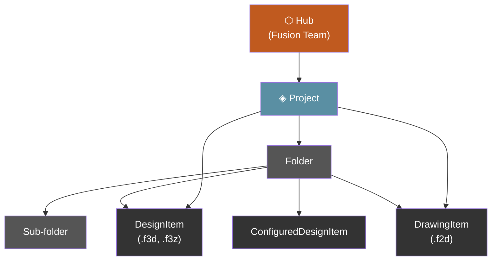
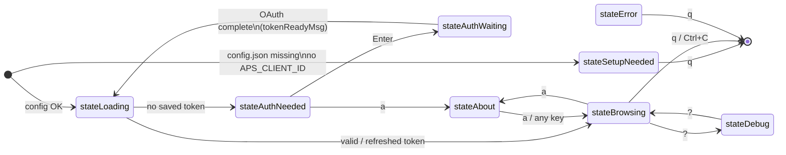
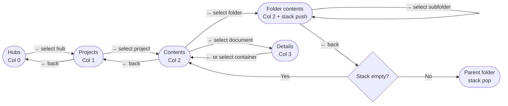
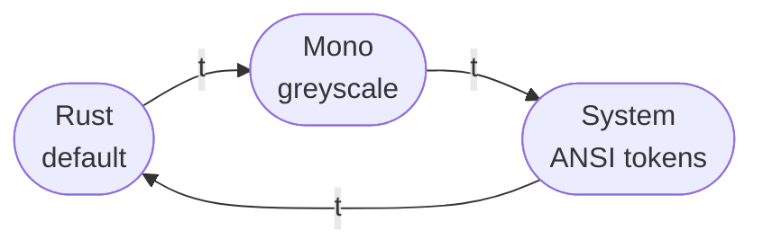

# Navigation & User Interface

FusionDataCLI presents the APS Manufacturing Data Model as a three-column ranger-style browser directly in your terminal. Each column represents one level of the hierarchy. Drilling right loads the next level; pressing left goes back.

---

## Data Hierarchy

The APS Manufacturing Data Model is a tree. FusionDataCLI maps each level to a column in the browser.



**Item types returned by the API:**

| `__typename` | Kind | Container | Description |
|---|---|---|---|
| (hub) | `hub` | ✓ | Top-level Fusion Team |
| (project) | `project` | ✓ | ACC / Fusion project |
| (folder) | `folder` | ✓ | Directory in project |
| `DesignItem` | `design` | — | Parametric design (.f3d) |
| `DrawingItem` | `drawing` | — | 2D drawing (.f2d) |
| `ConfiguredDesignItem` | `configured` | — | Configured design variant |
| other | `unknown` | — | Unsupported type |

---

## Application State Machine



### State descriptions

| State | Description |
|-------|-------------|
| `stateSetupNeeded` | No client ID found in env, config file, or build default. Displays setup instructions. |
| `stateLoading` | Checking saved tokens, refreshing if expired, loading initial hubs list. Spinner shown. |
| `stateAuthNeeded` | No valid token. Prompts user to press Enter to open browser login. |
| `stateAuthWaiting` | Browser opened, local callback server running, waiting for OAuth redirect. |
| `stateBrowsing` | Normal three-column (or four-column with details) interactive browser. |
| `stateAbout` | Scrollable overlay showing version, copyright, GPL-3.0 license, and third-party credits. |
| `stateDebug` | Scrollable overlay showing raw API request/response log (requires `APSNAV_DEBUG=1`). |
| `stateError` | Fatal error with full message. Quit only. |

---

## Key Bindings

### Navigation

| Key | Action |
|-----|--------|
| `↑` `w` | Move cursor up in active column |
| `↓` `s` | Move cursor down in active column |
| `→` `d` `Enter` | Move focus right — load next level or open details |
| `←` `a` | Move focus left — go back or pop folder from stack |
| `h` | Switch hub — re-open the hub picker |

### Actions

| Key | Action |
|-----|--------|
| `u` | Open focused document permalink in system default browser (only after details panel has loaded; no-op on folders/projects or during loading) |
| `o` | Open focused document in the running Fusion desktop client (via Fusion MCP server) |
| `i` | Insert focused document as a new occurrence into the active Fusion design (via Fusion MCP server) |
| `shift+d` | Download STEP file for the selected design (DesignItem only; no-op on drawings, configured designs, or containers) |
| `r` | Refresh current column |
| `t` | Cycle color theme (Rust → Mono → System → Rust) |
| `m` | Toggle mouse support on/off (default: on) |
| `shift+a` | Open About / License screen |
| `?` | Open debug log overlay |
| `q` `Ctrl+C` | Quit |

### Details-pane tabs

The details panel switches between four tabs that expose cross-references for the selected item. Tabs are lazily fetched on first activation and cached per item for the rest of the session. See [Details-pane tabs](#details-pane-tabs-1) below for the full behavior.

| Key | Action |
|-----|--------|
| `1` | Details tab |
| `2` | Uses tab |
| `3` | Where Used tab (DesignItem only) |
| `4` | Drawings tab (DesignItem only) |
| `↑` `↓` / `w` `s` (on a non-Details tab) | Move the tab cursor — *replaces* nav-column cursor while a non-Details tab is active |
| `Enter` (on a non-Details tab) | **Show in Location** for the highlighted row |

### Mouse

Mouse support is enabled by default and can be toggled with `m`. The footer bar reflects the current state (`mouse:on` / `mouse:off`).

| Action | Behavior |
|--------|----------|
| Left click (Projects) | Select and navigate into project |
| Left click (Contents - folder) | Select and drill into folder |
| Left click (Contents - document) | Select and load details |
| Left click (non-Details tab row) | Highlight the row (move tab cursor) |
| Double-click (non-Details tab row) | **Show in Location** — same as `Enter` |
| Scroll wheel | Move cursor up/down in active column |
| Scroll wheel (overlays) | Scroll hub list, about, or debug views |

---

## Screen Layout

### Three-column mode (default)

```
┌──────────────────────────────────────────────────────────────────────────┐
│ FusionDataCLI  My Team › Alpha › Designs                                 │
├──────────────────────┬──────────────────────┬────────────────────────────┤
│ Projects             │ Contents             │ Details                    │
│ ──────────────────   │ ──────────────────── │ ──────────────────────     │
│ > ◈ Alpha            │ > ▸ Designs/         │ Assembly v2                │
│   ◈ Beta             │   ▸ Archive/         │ Size      24.3 MB         │
│   ◈ Gamma            │     Assembly v2.f3d  │ Version   v7              │
│   ↓ more             │     Housing.f3d      │                           │
│                      │     ↓ more           │                           │
├──────────────────────┴──────────────────────┴────────────────────────────┤
│ [↑↓/ws] move  [←→/ad] navigate  [h] hubs  [u] web  [m] mouse:on  …    │
└──────────────────────────────────────────────────────────────────────────┘
```

The breadcrumb bar at the top shows the current navigation path: Hub > Project > Folder(s) > Document.

### Four-column mode (details panel auto-opens for selected documents)

```
┌────────────────────────────────────────────────────┬─────────────────────┐
│ Hubs        │ Projects      │ Contents             │ Details             │
│ ──────────  │ ───────────── │ ───────────────────  │ ──────────────────  │
│ ⬡ My Team  │ ◈ Alpha       │ > Assembly v2.f3d    │ Assembly v2         │
│             │               │   Housing.f3d        │                     │
│             │               │                      │ Size      24.3 MB   │
│             │               │                      │ Version   v7        │
│             │               │                      │ Type      Design    │
│             │               │                      │                     │
│             │               │                      │ Created             │
│             │               │                      │  Mar 15 2026        │
│             │               │                      │  Alice Smith        │
│             │               │                      │                     │
│             │               │                      │ Modified            │
│             │               │                      │  Mar 28 2026        │
│             │               │                      │  Bob Jones          │
│             │               │                      │                     │
│             │               │                      │ Component           │
│             │               │                      │ Part No.  MFG-001   │
│             │               │                      │ Desc      Main asm  │
│             │               │                      │ Material  Aluminum  │
│             │               │                      │ ★ Milestone         │
│             │               │                      │                     │
│             │               │                      │ Versions            │
│             │               │                      │  v7  Mar 28 2026    │
│             │               │                      │      Bob Jones      │
│             │               │                      │  v6  Mar 20 2026    │
│             │               │                      │      Alice Smith    │
└────────────────────────────────────────────────────┴─────────────────────┘
```

**Width allocation:**
- Details open: details panel = `(terminalWidth × 2) / 5`, nav columns split the remaining `3/5`
- Details closed: nav columns split the full terminal width equally
- Minimum column height: 3 rows

---

## Column Navigation Flow



---

## Folder Stack

Folder navigation uses an in-memory stack of `breadcrumbEntry` structs (storing both ID and display name) to allow arbitrary depth traversal and breadcrumb display:

```mermaid
sequenceDiagram
    participant User
    participant Model
    participant API

    User->>Model: → (navigate right on Folder A)
    Model->>Model: push "folderA-id" onto folderStack
    Model->>API: GetItems(hubID, "folderA-id")
    API-->>Model: items for Folder A

    User->>Model: → (navigate right on Sub-folder B)
    Model->>Model: push "subfolderB-id" onto folderStack
    Model->>API: GetItems(hubID, "subfolderB-id")
    API-->>Model: items for Sub-folder B

    User->>Model: ← (go back)
    Model->>Model: pop "subfolderB-id"; top = "folderA-id"
    Model->>API: GetItems(hubID, "folderA-id")
    API-->>Model: items for Folder A

    User->>Model: ← (go back)
    Model->>Model: pop "folderA-id"; stack empty
    Model->>API: GetFolders + GetProjectItems (project root)
    API-->>Model: project root contents
```

---

## Browser Open Logic

`u` is intentionally narrow: it only opens the per-item permalink from the APS Manufacturing Data Model GraphQL API's `DesignItem.fusionWebUrl` / `DrawingItem.fusionWebUrl` field, and only after the details panel has finished loading. The `[u] web` hint is pinned at the bottom of the details panel so the key appears actionable exactly when it is.

```mermaid
flowchart TD
    A{Non-container selected?} -- No --> Z[No-op]
    A -- Yes --> B{Details loaded\nAND FusionWebURL present?}
    B -- No --> W[No-op, status bar says\n"wait for details" or\n"no web URL available"]
    B -- Yes --> C[Open details.FusionWebURL\nin system default browser]
```

Earlier versions tried to fall back to the project-level `fusionWebUrl` or to hand-constructed URLs like `https://autodesk360.com/g/projects/<id>` and `https://acc.autodesk.com/docs/files/projects/<id>`. Those patterns are rejected by Autodesk's team web app with a raw JSON `BROWSER_LOGIN_REQUIRED` / `WEB SESSION INVALID` error for team hubs, and they don't round-trip through the hub-subdomain routing that the real web app expects. They've been removed — the only trusted source is the item-level permalink.

The status bar prints the full URL as it's handed to the OS browser handler, and an `OPEN_BROWSER <url>` line is appended to the debug log (`APSNAV_DEBUG=1`) for inspection.

---

## STEP Download

`shift+d` exports the selected design to a STEP file on local disk. Implemented in `api/download.go` and driven from `ui/app.go`'s `downloadStep` / `requestStepCmd` / `pollStepCmdAfter` / `downloadStepFileCmd`.

```mermaid
flowchart TD
    A{DesignItem selected?\nDetails loaded?\nRootComponentVersionID set?} -- No --> Z[No-op with status hint:\nwait for details / not a design /\ndownload already in progress]
    A -- Yes --> B[Set downloadInProgress = true\nstatusMsg: \"Requesting STEP translation…\"]
    B --> C[GraphQL: componentVersion.derivatives\noutputFormat: STEP, generate: true]
    C --> D{Status?}
    D -- PENDING --> E[Tea.Tick 2s, retry GraphQL]
    E --> D
    D -- FAILED --> F[Status bar: error, clear flag]
    D -- SUCCESS --> G[GET signedUrl (no bearer attached)\nstream to ~/Downloads/&lt;name&gt;-&lt;ts&gt;.stp]
    G --> H[Status bar: \"Saved to <path>\"]
```

**Restrictions:**
- Only valid on `DesignItem`. Drawings (`DrawingItem`) and configured designs (`ConfiguredDesignItem`) have no `tipRootComponentVersion`, so the API can't generate a STEP — the UI rejects the keypress with a status-bar hint.
- A second `shift+d` while a download is in flight is rejected so polls don't pile up.
- The destination path is `~/Downloads/<sanitised-name>-<YYYYMMDD-HHMMSS>.stp`, falling back to `os.TempDir()` if the home directory cannot be determined.

The signed URL returned by the derivatives query is downloaded **without** an `Authorization` header — APS signed URLs are self-authenticated, and attaching the user's bearer would leak it if the URL were ever poisoned. (Security finding **H2**, fixed in PR #1.)

---

## Fusion Desktop Integration

The `o` (open) and `i` (insert) keys talk to the running Fusion desktop client via its local MCP (Model Context Protocol) server, expected at:

```
http://127.0.0.1:27182/mcp
```

For `o`, the CLI calls the `fusion_mcp_execute` tool with `featureType=document`, `operation=open`, and the item's lineage URN as `fileId`. Fusion opens the document in a new window.

For `i`, the CLI calls `fusion_mcp_execute` with `featureType=script` and runs a short Python snippet that resolves the lineage URN via `app.data.findFileById(...)` and inserts it into the active design using `rootComponent.occurrences.addByInsert(...)`. Insert requires that a design document already be active in Fusion.

Both operations require Fusion to be running locally with the MCP server enabled. If Fusion is not reachable or returns an error, the status bar shows the error message.

### Hub Consistency Check

Because FusionDataCLI and the running Fusion client can browse independent hubs, both `o` and `i` first verify that Fusion is on the same hub as the CLI before sending the open/insert call. The check works like this:

1. Call `fusion_mcp_read` with `queryType=projects` — returns the projects in Fusion's currently active hub.
2. Look up the currently-selected project's Data Management API ID (`NavItem.AltID`, e.g. `20250213876602531`) in the returned list.
3. If the project is present, the hubs match; the open/insert call proceeds.
4. If the project is missing, the open/insert call is **not** sent. The status bar displays:

   ```
   Fusion: Fusion is on a different hub — switch Fusion to "<hub name>" and retry
   ```

This prevents accidentally opening or inserting a file from one hub into a window that is showing content from another hub.

---

## Color Themes

Three themes are available, cycled with `t`:



| Element | Rust | Mono | System (ANSI) |
|---------|------|------|---------------|
| Accent / highlights | `#C05A1F` orange | `#CCCCCC` light grey | `6` cyan |
| Borders / inactive | `#555555` steel | `#444444` dark grey | `5` purple |
| Dim / muted | `#888888` grey | `#777777` grey | `5` purple |
| Foreground | `#FFFFFF` white | `#FFFFFF` white | `7` white |
| Errors | `#FF5555` red | `#FF5555` red | `1` red |
| Details key labels | `#888888` grey | `#999999` grey | `6` cyan |
| Loading / empty | `#888888` grey | `#777777` grey | `3` yellow |
| Container items | `#89B4D4` blue | `#EEEEEE` light | `2` green |
| Document items | `#FFFFFF` white | `#AAAAAA` dim | `7` white |

The System theme uses ANSI color token numbers rather than hex values, so it inherits and respects your terminal's color scheme (e.g. Solarized, Catppuccin, Nord).

---

## Details Panel

The details panel sits alongside the browser columns and auto-loads whenever the cursor lands on a document item (design, drawing, or configured design). When the cursor moves to a container (project / folder) the panel clears. Re-visiting a previously-loaded item is served instantly from the in-memory `detailsCache` — no API call is made.

**Fields shown (Details tab):**

| Section | Fields |
|---------|--------|
| Header | Item name |
| File | Size (human-readable), Version number, MIME type, Extension type |
| Created | Date (Jan 02 2006 format), User full name |
| Modified | Date, User full name |
| Component (designs only) | Part number, Description, Material, Milestone flag |
| Versions | Up to 10 most recent versions — version number, date, author, save comment |

Version history is displayed newest-first. The `itemVersions` query returns them oldest-first; the UI reverses the slice.

---

## Details-pane tabs

For documents the details column has a tab strip that swaps the body between four cross-references. The strip auto-narrows to abbreviated labels (`Det / Uses / WUsed / Dwg`) when the column can't fit the full set, and tabs that don't apply to the current item type are hidden entirely.

```
╭────────────────────────────────────────╮
│ Details │ Uses │ Where Used │ Drawings │
│                                        │
│ Spur Gear Cover - Rear                 │
│   in 2021-02.f3d                       │
│ Locknut M2.5  PN-000060                │
│   in Locknut M2.5.f3d                  │
│ ISO 7089 - 3 Steel 100 HV Plain        │
│   in ISO 7089 - 3 Steel 100 HV Plain   │
│   ↓ 19 more                            │
│                                        │
│ [o] web  [f] open  [i] insert  [d] step│
│ [1-4] tabs                             │
╰────────────────────────────────────────╯
```

### Per-item-type tab visibility

| Item type | Tabs available | Notes |
|---|---|---|
| `DesignItem` (with `tipRootComponentVersion`) | Details, Uses, Where Used, Drawings | Full set |
| `DrawingItem` | Details, Uses | Uses = source design (the design the drawing was made from) |
| `ConfiguredDesignItem` | (none — simple Details view, no strip) | The strip is hidden so the panel falls back to the basic title |
| `BasicItem` (everything else: STEP imports, .max, .par, …) | (none) | Same as above |

### What each tab returns

| Tab | Source | Cache key | API |
|-----|--------|-----------|-----|
| **Details** | Eagerly fetched the moment an item is selected; no extra round trip on activation | item ID | `GetItemDetails` |
| **Uses** (DesignItem) | The immediate sub-component versions (occurrences) of the design's tip root component version | `tipRootComponentVersion.id` | `GetOccurrences` |
| **Uses** (DrawingItem) | The source design referenced by the drawing's tip drawing version | drawing item ID | `GetDrawingSource` |
| **Where Used** | Component versions that reference the design's tip root, deduped by parent DesignItem so each containing design appears once regardless of how many of its versions reference the component | `tipRootComponentVersion.id` | `GetWhereUsed` |
| **Drawings** | Drawings made from any version of the design, deduped by drawing lineage URN, sorted by latest modification first | design item ID | `GetDrawingsForDesign` |

### Tab cursor and Show in Location

While a non-Details tab is active, the cursor moves *within the tab list* instead of the Contents column. To resume Contents nav, press `1` to return to the Details tab.

`Enter` (or double-click) on a highlighted tab row triggers **Show in Location** — a multi-step navigation that lands the Contents column on the row's underlying item:

```mermaid
sequenceDiagram
    participant U as User
    participant M as Model
    participant API as api package
    participant APS as APS GraphQL

    U->>M: Enter / double-click on a tab row
    M->>API: GetItemLocation(hubId, itemId)
    API->>APS: item(hubId, itemId) { project, parentFolder { id name } }
    APS-->>API: project metadata + immediate parent
    loop walk parentFolder up the chain
        API->>APS: folderByHubId(hubId, folderId) { parentFolder }
        APS-->>API: next ancestor or null
    end
    API-->>M: ItemLocation { project, [F-root … F-leaf], hubId }

    M->>M: switch project cursor; queue pendingNav { folders, targetItemId }
    M->>API: loadProjectContentsCmd(project)
    API-->>M: contentsLoadedMsg { items }

    loop drill folders[0…N]
        M->>M: cursor lands on next folder; push folderStack
        M->>API: loadItemsCmd(hubId, folderId)
        API-->>M: contentsLoadedMsg { items }
    end

    M->>M: cursor lands on targetItemId in the leaf folder; pendingNav cleared
    M->>API: loadDetailsCmd (auto-load details for the located item)
```

**Friendly fall-throughs:**

- If the located item lives in a different hub, the status bar shows `Item is in another hub (project: <name>)` and the user stays put.
- If the project isn't visible to the user (e.g. permissions revoked), the status bar shows `Item is in a project not visible here: <name>`.
- If a folder in the chain isn't found in the parent's contents (rare; typically a stale ancestor URN), the drill stops, the status bar shows `Folder not found in contents: <name>`, and the cursor rests at the deepest folder that did resolve.

### Caching and invalidation

All four tabs share the same per-item invalidation rules as the existing `detailsCache`:

- **Hub change** (re-select via `h`) — every tab cache is cleared. The new hub's items have different URNs.
- **Refresh** (`r`) — every tab cache is cleared and the active tab refetches.
- **Item change** (cursor moves to another design / drawing) — caches survive (they're keyed by item, not by selection), but per-tab loading flags, errors, cursor, and scroll reset to zero. The active tab persists across item changes so a "scan Where Used across these designs" workflow works without re-pressing the tab key per item.
