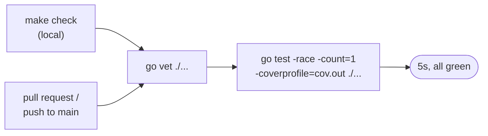
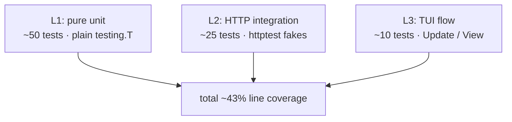

# Testing

How the FusionDataCLI test suite is structured, how to run it, and how to add a new test that fits the existing pattern.

The suite is small (~80 test functions, finishes under five seconds with `-race`) but covers the full vertical slice from pure helpers up through Bubble Tea state-machine transitions driven against a fake APS server.

---

## Running the suite

```sh
make check                    # the canonical command; runs vet + race + counts=1
go test ./... -race           # same as the test half of `make check`
go test ./api/... -run Drawings -v   # run a single subset
go test -coverprofile=cov.out ./...
go tool cover -func=cov.out          # per-function coverage breakdown
go tool cover -html=cov.out          # browser report
```

CI runs the same commands on every pull request and push to `main` (`.github/workflows/test.yml`). A failing test blocks merge; a failing `go vet` blocks merge.



---

## Three-layer architecture

Tests live alongside the code they exercise (`*_test.go` files) and fall into three layers. Each layer answers a different question; together they cover the same flow at different fidelities so failures point at the smallest broken piece.

| Layer | Question it answers | Example |
|-------|--------------------|---------|
| **L1 — pure unit** | "Does this helper return the right output for the right input?" | `formatSize`, `truncate`, `parseTime`, `verifierToChallenge`, `navItemFromTypename` |
| **L2 — HTTP integration** | "Does this code make the right HTTP request and parse the response correctly?" | `gqlQuery` against a fake GraphQL server, `Login` against a fake auth server, MCP retry against a fake MCP server |
| **L3 — TUI flow** | "When the user does X, does the right state transition happen and the right Cmd fire?" | `Update(KeyMsg{Right})` produces a `loadProjectContentsCmd` that flows through `api.GetFolders` + `api.GetProjectItems` against a mocked APS endpoint and yields a `contentsLoadedMsg` with the right items |

L1 tests are the bulk of the suite. L2 tests catch wire-format bugs (wrong field name, wrong query shape, wrong header). L3 tests catch state-machine bugs (wrong command fired, wrong message handled). Each L3 test typically replaces what would otherwise be a manual test session.



### Coverage expectations

| Package | Floor (CI fails below) | Current |
|---|---|---|
| `config` | 80% | 90.6% |
| `auth` | 70% | 73.9% |
| `fusion` | 75% | 84.2% |
| `api` | 65% | ~70% |
| `pins` | 70% | ~85% |
| `ui` | 30% | ~40% |

UI is intentionally lower because View() rendering is exercised by humans; the L3 tests cover the state-machine transitions that *drive* View() but don't assert on the styled output. Don't chase UI coverage by writing pixel-snapshot tests — they break on every theme tweak and don't catch logic bugs.

---

## Shared fixtures: `internal/testutil/`

Two helpers live in `internal/testutil/`. Both auto-clean via `t.Cleanup`, so callers don't have to defer anything.

### `GraphQLServer(t, handler)` — fake APS GraphQL endpoint

```go
srv := testutil.GraphQLServer(t, func(req testutil.GraphQLRequest) testutil.GraphQLResponse {
    if !strings.Contains(req.Query, "occurrences(pagination") {
        t.Errorf("query missing occurrences field: %q", req.Query)
    }
    return testutil.GraphQLResponse{Data: map[string]any{
        "componentVersion": map[string]any{
            "occurrences": map[string]any{
                "pagination": map[string]any{"cursor": ""},
                "results":    []map[string]any{ /* ... */ },
            },
        },
    }}
})
swapEndpoint(t, srv.URL)   // helper inside api/ that overwrites graphqlEndpoint
```

`GraphQLRequest` exposes the decoded `{Query, Variables}` plus the captured `Authorization` and `X-Ads-Region` headers. `GraphQLResponse` lets you set `Data`, `Errors`, `Status`, or `RawBody` (raw body wins, used for malformed-response tests). The server defaults to `200 OK` on the response; use the `Status` field to send `401`, `5xx`, etc.

Used by `auth/oauth_test.go`, every `api/*_test.go`, and `ui/app_test.go` (via `api.SetGraphqlEndpointForTesting`).

### `NewMCPServer(t, scenario)` — fake Fusion MCP JSON-RPC server

```go
mcp := testutil.NewMCPServer(t, testutil.MCPScenario{
    SessionID: "sid-123",
    Tools: map[string]testutil.MCPHandler{
        "fusion_mcp_execute": func(args map[string]any) testutil.MCPResponse {
            return testutil.MCPResponse{ContentText: `{"success": true}`}
        },
    },
})
client := fusion.NewClientForTesting(mcp.URL)
```

Tracks per-tool call counts, init counts, and session-ID arrival order so tests can assert on session-cache and retry behaviour. Used by `fusion/mcp_test.go` and `ui/app_test.go` for the open/insert flows.

---

## Const→var injection pattern

Several production endpoints and clock dependencies are declared as package-level `var` (rather than `const`) specifically so tests can swap them. **Production code never reassigns them.** Do not refactor any of these back to `const` without first plumbing in a different injection mechanism — the tests rely on direct overwrites.

| Symbol | Package | What tests do |
|--------|---------|---------------|
| `graphqlEndpoint` | `api/client.go` | Point at `httptest.Server.URL` |
| `retryBackoffs` | `api/client.go` | Replace with millisecond delays so retry tests run instantly |
| `authEndpoint`, `tokenEndpoint`, `authScope` | `auth/oauth.go` | Point at fake auth server |
| `callbackPort`, `CallbackURL` | `auth/callback.go` | Set to `0` so the kernel assigns an ephemeral port; rewrite `CallbackURL` to the resolved address |
| `userHomeDir`, `nowFunc` | `api/download.go` | Stub home dir to `t.TempDir()`; freeze the clock for deterministic STEP-path output |

This is the convention to follow when adding a new external dependency or non-deterministic input that needs to be mockable.

### Cross-package endpoint swapping

Same-package tests can write the `var` directly. Cross-package tests (notably `ui/` flow tests that drive a `tea.Cmd` which calls into `api`) must use the exported helper:

```go
restore := api.SetGraphqlEndpointForTesting(srv.URL)
defer restore()
```

This returns a closure that restores the prior value, so parallel-safe `t.Cleanup`-style usage is straightforward. The helper is reserved for tests; production code must never call it.

---

## Naming conventions

| Pattern | Used for | Example |
|---|---|---|
| `TestThing_DoesX` | Pure unit on `Thing` | `TestNavItemFromTypename`, `TestSanitizeHubID` |
| `TestFunc_HappyPath` | The clean success path | `TestGqlQuery_HappyPath`, `TestClassifyAssembly_Part` |
| `TestFunc_<Edge>` | A specific edge case | `TestGqlQuery_401_Wraps`, `TestClassifyAssembly_EmptyID`, `TestMigrateLegacy_DropsHubless` |
| `TestUpdate_<Msg>_<Effect>` | Bubble Tea Update on a specific message | `TestUpdate_TabSelect_DispatchesLoad`, `TestUpdate_ItemClassified_StaleGenDropped`, `TestUpdate_ContentsLoaded_FansOutClassifyCmds` |
| `TestHandle<X>_<Effect>` | A direct call to a handler method | `TestHandleItemLocation_CrossHub`, `TestHandleItemLocation_DrillsFolders` |
| `TestView_<Scenario>_NoCrash` | Render-doesn't-panic tests across terminal sizes | `TestView_AfterHubSelect_NoCrash` |

Subtests via `t.Run(name, func(t *testing.T) { ... })` are encouraged for table-driven tests. Sub-test names should be human-readable (`"empty stays empty"`), not just numbers.

---

## Adding a new test

The cheapest way to land a useful test is to copy the closest existing one and adapt.

### A new pure-unit test

1. Open the `*_test.go` file next to the code you're testing.
2. Use a table-driven shape if there's more than one case. The pattern from `api/queries_test.go::TestNavItemFromTypename` is the canonical example.
3. Avoid I/O — that's L2's job.

### A new HTTP-integration test

1. Spin up a `testutil.GraphQLServer` that captures the fields you want to assert on.
2. Use `swapEndpoint(t, srv.URL)` if you're inside the `api` package, or `api.SetGraphqlEndpointForTesting(srv.URL)` if you're outside it.
3. Drive the function under test directly. Assert on both the request shape (via the captured `GraphQLRequest`) and the decoded result.

For retry tests, also override `retryBackoffs`:

```go
prev := retryBackoffs
retryBackoffs = []time.Duration{0, 1 * time.Millisecond, 1 * time.Millisecond}
t.Cleanup(func() { retryBackoffs = prev })
```

### A new TUI flow test

1. Build a Model directly (don't go through `New()`; supply only the fields the test needs).
2. Call `m.Update(msg)` and inspect the returned `(Model, tea.Cmd)`.
3. If the cmd should fire a follow-up, invoke `cmd()` and assert on the resulting message.

Look at `ui/app_test.go::TestUpdate_NavigateRight_LoadsContents` for the canonical end-to-end shape (KeyMsg → Update → tea.Cmd → mocked APS → contentsLoadedMsg → assert).

---

## Anti-patterns to avoid

- **No `time.Sleep` in tests.** If you find yourself reaching for it, the test is racy. Either inject a clock (see `nowFunc`) or use channels / `t.Cleanup` to coordinate.
- **No real network.** Every HTTP call goes to a `testutil.GraphQLServer` or `NewMCPServer`. A test that hits `developer.api.autodesk.com` will fail in CI (no token) and is non-deterministic anyway.
- **No skips for "flaky" tests.** If a test is flaky, find the race and fix it. Adding `t.Skip` masks the bug.
- **No fixture files for response payloads.** Inline the JSON shape into the test handler. The shape is part of the contract under test; hiding it in a `testdata/foo.json` file makes the test harder to read.
- **No pixel-snapshot tests for the TUI.** Lipgloss styling changes too often; a snapshot test against `View()` becomes maintenance overhead with no real signal.

---

## Manual / exploratory testing

Some things are hard to assert on automatically — colour rendering, breadcrumb mouse hits across resizes, the look of the tab strip on different terminals. The development workflow for those is:

1. `make build CLIENT_ID=…` to produce a binary with your APS client ID embedded.
2. Run it interactively across the terminal sizes you care about (80×24 minimum, plus your preferred wide layout).
3. If a regression is found, capture it as a new L3 flow test if possible (most state-machine bugs are catchable that way), or as an L1 layout-math test (e.g. `TestFitFooterLineNeverWraps`).

The general rule: every new feature gets at least one test at the layer that most directly proves it works. Show-in-Location got an API decode test (L2) and a `handleItemLocation` test (L3); the tab cursor got a key-dispatch test (L3) and a navigation test for cross-hub fall-through (L3). Don't ship a feature without one.
