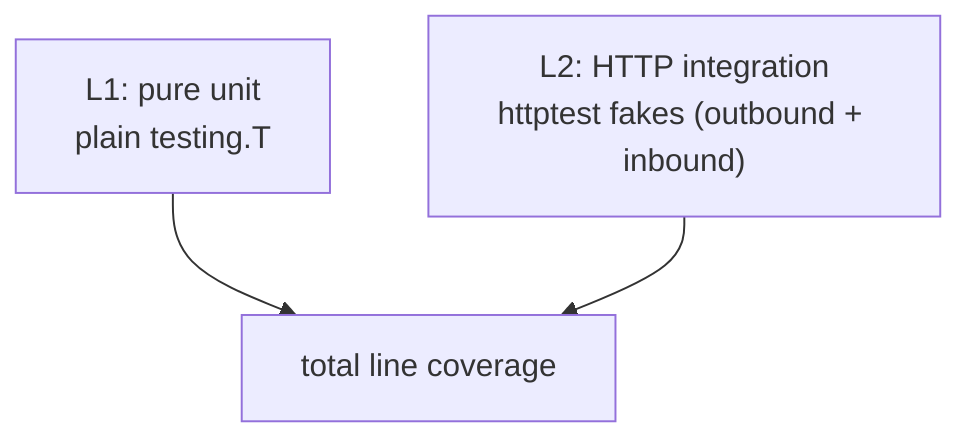

# Testing

How the fusionlocalserver test suite is structured, how to run it, and how to add a new test that fits the existing pattern.

The suite is small (finishes under five seconds with `-race`) but covers the full vertical slice from pure helpers up through HTTP integration against a fake APS server. The `server` package adds its own focused tests (per-user auth and session lifecycle, settings persistence, the thumbnail cache, and a thumbnail handler) alongside the shared layers it reuses.

---

## Running the suite

```sh
make check                    # the canonical command; runs vet + race + counts=1
go test ./... -race           # same as the test half of `make check`
go test ./api/... -run Drawings -v   # run a single subset
go test -coverprofile=cov.out ./...
go tool cover -func=cov.out          # per-function coverage breakdown
go tool cover -html=cov.out          # browser report
```

CI runs the same commands on every pull request and push to `main` (`.github/workflows/test.yml`). A failing test blocks merge; a failing `go vet` blocks merge.


---

## Two-layer architecture

Tests live alongside the code they exercise (`*_test.go` files) and fall into two layers. Each layer answers a different question; together they cover the same flow at different fidelities so failures point at the smallest broken piece.

| Layer | Question it answers | Example |
|-------|--------------------|---------|
| **L1 — pure unit** | "Does this helper return the right output for the right input?" | `formatSize`, `truncate`, `parseTime`, `verifierToChallenge`, `navItemFromTypename`, `randToken`, `redactSignedURLs` |
| **L2 — HTTP integration** | "Does this code make the right HTTP request / handle the right HTTP request and parse the response correctly?" | `gqlQuery` against the fake APS GraphQL server, `ExchangeCode`/`Refresh` against a fake token endpoint, the server's `requireAuth`, login-redirect, and OAuth-callback handlers driven through `httptest` |

L1 tests are the bulk of the suite. L2 tests catch wire-format bugs (wrong field name, wrong query shape, wrong header) on the outbound side and request-handling bugs (wrong status, missing cookie, state mismatch) on the inbound `server` side.



### Coverage expectations

| Package | Floor (CI fails below) | What it covers |
|---|---|---|
| `config` | 80% | config dir/path resolution, region + legacy migration |
| `auth` | 60% | PKCE generation, auth-URL building, code exchange (public + confidential clients), token refresh, token validity |
| `api` | 65% | GraphQL client (queries, refs, classify, details, locate, thumbnail, properties), retry loop, signed-URL redaction |
| `pins` | 70% | pin add/remove/list persistence |
| `server` | 25% | per-user auth + session lifecycle (`requireAuth`, login/callback/logout, single-flight token refresh), settings persistence, thumbnail cache + handler |

The `server` floor is intentionally lower than the data-layer packages: a large fraction of its statements are the SPA file-serving / dev-proxy plumbing and the top-level serve loop, which are exercised by hand rather than in unit tests. The tested *logic* (auth, sessions, settings, thumbcache) is well-covered; don't chase the package number by asserting on static-asset wiring.

---

## Shared fixtures: `internal/testutil/`

A single helper lives in `internal/testutil/` (`graphql.go`). It auto-cleans via `t.Cleanup`, so callers don't have to defer anything.

### `GraphQLServer(t, handler)` — fake APS GraphQL endpoint

```go
srv := testutil.GraphQLServer(t, func(req testutil.GraphQLRequest) testutil.GraphQLResponse {
    if !strings.Contains(req.Query, "occurrences(pagination") {
        t.Errorf("query missing occurrences field: %q", req.Query)
    }
    return testutil.GraphQLResponse{Data: map[string]any{
        "componentVersion": map[string]any{
            "occurrences": map[string]any{
                "pagination": map[string]any{"cursor": ""},
                "results":    []map[string]any{ /* ... */ },
            },
        },
    }}
})
swapEndpoint(t, srv.URL)   // helper inside api/ that overwrites graphqlEndpoint
```

`GraphQLRequest` exposes the decoded `{Query, Variables}` plus the captured `Authorization` and `X-Ads-Region` headers. `GraphQLResponse` lets you set `Data`, `Errors`, `Status`, or `RawBody` (raw body wins, used for malformed-response tests). The server defaults to `200 OK` on the response; use the `Status` field to send `401`, `5xx`, etc.

Used by every `api/*_test.go` (the `api` package's same-package tests write `graphqlEndpoint` directly).

The fake APS token / userinfo endpoints used by `auth/*_test.go` and the fake auth indirections used by `server/*_test.go` are plain `httptest.Server`s spun up inline in those test files rather than shared helpers; the `server` tests more commonly swap the `authExchange` / `authRefresh` / `authUserInfo` package vars (see below) so they never touch the network at all.

---

## Const→var injection pattern

Several production endpoints and clock dependencies are declared as package-level `var` (rather than `const`) specifically so tests can swap them. **Production code never reassigns them.** Do not refactor any of these back to `const` without first plumbing in a different injection mechanism — the tests rely on direct overwrites.

| Symbol | Package | What tests do |
|--------|---------|---------------|
| `graphqlEndpoint` | `api/client.go` | Point at `httptest.Server.URL` |
| `retryBackoffs` | `api/client.go` | Replace with millisecond delays so retry tests run instantly |
| `tokenEndpoint`, `authEndpoint`, `authScope` | `auth/oauth.go` | Point at a fake token endpoint for code-exchange / refresh tests |
| `userInfoEndpoint` | `auth/userinfo.go` | Point at a fake userinfo endpoint for `FetchUserProfile` tests |
| `authExchange`, `authRefresh`, `authUserInfo` | `server/auth.go` | Indirections over the `auth` package (`auth.ExchangeCode` / `auth.Refresh` / `auth.FetchUserProfile`) — swap to stubs so handler and session tests exercise the callback/refresh logic without hitting the network |

Time is injected where it matters rather than via a global clock: the `SessionStore`'s expiry check takes an explicit `now time.Time`, and session/pending tests construct entries with chosen timestamps and short TTLs to drive idle / absolute expiry and the single-use pending path deterministically.

This is the convention to follow when adding a new external dependency or non-deterministic input that needs to be mockable.

### Cross-package endpoint swapping

Same-package tests can write the `var` directly. Cross-package callers use the exported helper:

```go
restore := api.SetGraphqlEndpointForTesting(srv.URL)
defer restore()
```

This returns a closure that restores the prior value, so parallel-safe `t.Cleanup`-style usage is straightforward. The helper is reserved for tests; production code must never call it.

---

## Naming conventions

| Pattern | Used for | Example |
|---|---|---|
| `TestThing_DoesX` | Pure unit on `Thing` | `TestNavItemFromTypename`, `TestRandToken_UniqueAndNonEmpty` |
| `TestFunc_HappyPath` | The clean success path | `TestGqlQuery_HappyPath`, `TestClassifyAssembly_Part`, `TestHandleAuthCallback_HappyPath` |
| `TestFunc_<Edge>` | A specific edge case | `TestGqlQuery_401_Wraps`, `TestClassifyAssembly_EmptyID`, `TestRequireAuth_UnknownSession`, `TestHandleAuthCallback_StateMismatch` |
| `TestHandle<X>_<Effect>` | A direct call to an HTTP handler | `TestHandleAuthMe`, `TestHandleAuthLogin_RedirectAndPending`, `TestHandleThumbnailImage_ServesCachedBytes` |
| `Test<Store>_<Behaviour>` | A store / lifecycle assertion | `TestSessionStore_IdleExpiry`, `TestSessionStore_Sweep`, `TestPendingStore_TakeIsSingleUse` |

Subtests via `t.Run(name, func(t *testing.T) { ... })` are encouraged for table-driven tests. Sub-test names should be human-readable (`"empty stays empty"`), not just numbers.

---

## Adding a new test

The cheapest way to land a useful test is to copy the closest existing one and adapt.

### A new pure-unit test

1. Open the `*_test.go` file next to the code you're testing.
2. Use a table-driven shape if there's more than one case. The pattern from `api/queries_test.go::TestNavItemFromTypename` is the canonical example.
3. Avoid I/O — that's L2's job.

### A new outbound HTTP-integration test (the `api` / `auth` client side)

1. Spin up a `testutil.GraphQLServer` (or, for `auth`, a plain `httptest.Server`) that captures the fields you want to assert on.
2. Write `graphqlEndpoint` (or `tokenEndpoint` / `userInfoEndpoint`) directly inside the package, or `api.SetGraphqlEndpointForTesting(srv.URL)` from outside `api`.
3. Drive the function under test directly. Assert on both the request shape (via the captured `GraphQLRequest`) and the decoded result.

For retry tests, also override `retryBackoffs`:

```go
prev := retryBackoffs
retryBackoffs = []time.Duration{0, 1 * time.Millisecond, 1 * time.Millisecond}
t.Cleanup(func() { retryBackoffs = prev })
```

### A new inbound handler / session test (the `server` side)

1. Construct a `*Server` (or just the `SessionStore` / `PendingStore`) with only the fields the test needs.
2. Swap `authExchange` / `authRefresh` / `authUserInfo` to stubs so the handler never hits the network, and use `quietLogger()` (from `server/helpers_test.go`) to keep test output clean.
3. Drive the handler through `httptest.NewRequest` + `httptest.NewRecorder`, then assert on the status, `Set-Cookie`, redirect `Location`, or the token injected into the request context.

Look at `server/auth_test.go::TestHandleAuthCallback_HappyPath` for the canonical end-to-end shape, and `TestSessionToken_RefreshesExactlyOnce` for the concurrency contract (a session refreshes at most once under load).

---

## Anti-patterns to avoid

- **No `time.Sleep` in tests.** If you find yourself reaching for it, the test is racy. Either inject the clock (pass an explicit `now` / use short TTLs, as the session tests do) or use channels / `t.Cleanup` to coordinate.
- **No real network.** Every outbound HTTP call goes to a `testutil.GraphQLServer` or an inline `httptest.Server`; `server` handler tests swap `authExchange` / `authRefresh` / `authUserInfo` to stubs. A test that hits `developer.api.autodesk.com` will fail in CI (no token) and is non-deterministic anyway.
- **No skips for "flaky" tests.** If a test is flaky, find the race and fix it. Adding `t.Skip` masks the bug.
- **No fixture files for response payloads.** Inline the JSON shape into the test handler. The shape is part of the contract under test; hiding it in a `testdata/foo.json` file makes the test harder to read.
- **Never log or assert on secrets.** Tokens are never written to logs, and `signedUrl` values are redacted before tracing (`redactSignedURLs`); tests assert the redaction, not the raw credential.

---

## Manual / exploratory testing

Some things are hard to assert on automatically — the look and feel of the React/MUI SPA, OAuth login against the real APS tenant, hover/select theming, thumbnail rendering across real designs. The development workflow for those is:

1. `make build CLIENT_ID=…` to produce a binary with your APS client ID embedded, or run with `-dev` to proxy the web UI to the Vite dev server for HMR.
2. Open the SPA in a browser, log in through the real OAuth flow, and exercise the feature end to end.
3. Run with `-v` when you need request/response traces (console + `~/.config/fusionlocalserver/server.log`); `signedUrl` values are redacted and tokens are never logged.
4. If a regression is found, capture it as a new test at the layer that most directly proves it works — an `api` decode test (L2) for a wire-format bug, a `server` handler test (L2) for an auth/session bug, or a pure-unit test (L1) for a helper.

The general rule: every new feature gets at least one test at the layer that most directly proves it works. Don't ship a feature without one.
